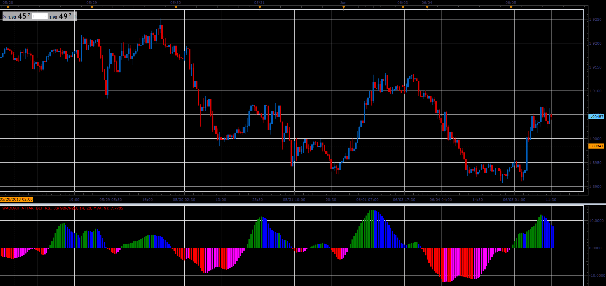

# Waddah_Attar_Def_RSI oscillator

> Source: https://fxcodebase.com/code/viewtopic.php?f=48&t=66462  
> Forum: 48 · Topic 66462 · 1 post(s)

---

## Waddah_Attar_Def_RSI oscillator

**Alexander.Gettinger** · Tue Aug 07, 2018 12:07 pm

Formula:
WA_Def_RSI[i]=MA(RSI1(Weighted price)-RSI2(Weighted price)).

 

Download:

 [Waddah_Attar_Def_RSI_JS.jsl](files/120419/Waddah_Attar_Def_RSI_JS.jsl)

For this indicator must be installed Averages indicator ([viewtopic.php?f=17&t=2430](https://fxcodebase.com/code/viewtopic.php?f=17&t=2430)).
