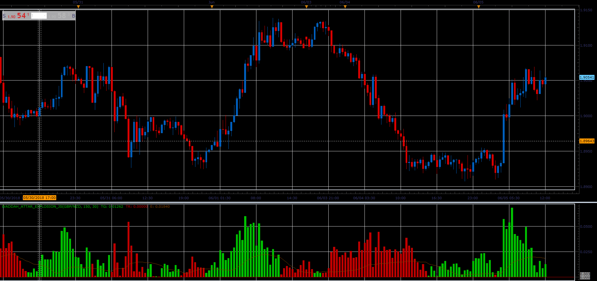

# Waddah Attar's Explosion Oscillator

> Source: https://fxcodebase.com/code/viewtopic.php?f=48&t=66463  
> Forum: 48 · Topic 66463 · 2 post(s)

---

## Waddah Attar's Explosion Oscillator

**Alexander.Gettinger** · Tue Aug 07, 2018 12:09 pm

The green bars shows the strength of the up trend.
The red bars shows the strength of the down trend.
The trend lines are calculates as difference b/w the current and the previous values EMA(20) - EMA(40) (the MACD line).

Brown line shows dynamics of volatility.
Brown line is a distance between 20 periods Bollinger's bands with factor 2.

The recommendation is to buy when up trend becomes stronger and volatility increases.
The recommendation is to sell when down trend becomes stronger and volatility increases.

 

Download:

 [Waddah_Attar_Explosion_JS.jsl](files/120420/Waddah_Attar_Explosion_JS.jsl)

---

## Re: Waddah Attar's Explosion Oscillator

**jshbrgs07** · Mon Feb 17, 2020 6:03 am

Hello,

Does this come with a .lua version?

Warm regards,
