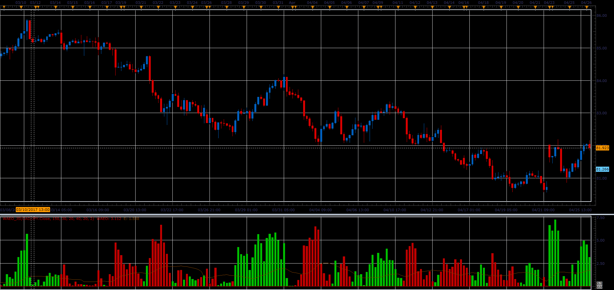

# Waddah Attar's Explosion Oscillator

> Source: https://fxcodebase.com/code/viewtopic.php?f=48&t=64877  
> Forum: 48 · Topic 64877 · 1 post(s)

---

## Waddah Attar's Explosion Oscillator

**Alexander.Gettinger** · Mon Jul 03, 2017 12:19 pm

The green bars shows the strength of the up trend.
The red bars shows the strength of the down trend.
The trend lines are calculates as difference b/w the current and the previous values EMA(20) - EMA(40) (the MACD line).

Brown line shows dynamics of volatility.
Brown line is a distance between 20 periods Bollinger's bands with factor 2.

The recommendation is to buy when up trend becomes stronger and volatility increases.
The recommendation is to sell when down trend becomes stronger and volatility increases.

 

Download:

 [WAEO_JS.jsl](files/113370/WAEO_JS.jsl)
