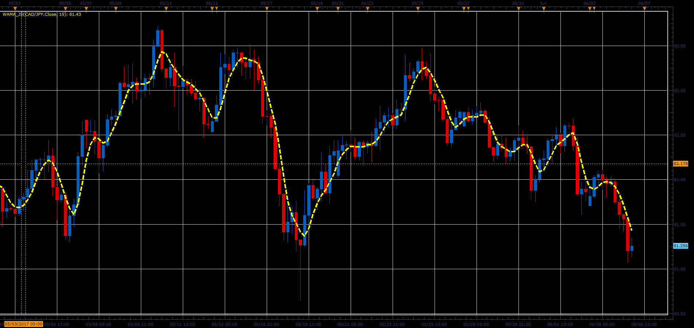

# Wama indicator

> Source: https://fxcodebase.com/code/viewtopic.php?f=48&t=64878  
> Forum: 48 · Topic 64878 · 1 post(s)

---

## Wama indicator

**Alexander.Gettinger** · Mon Jul 03, 2017 12:20 pm

Formula:
Wama[i] = EMA[i]+vel+acc/2+a/6, where
vel[i] = EMA[i]-EMA[i-Period/4],
acc[i] = EMA[i]-2*EMA[i-Period/4]+EMA[i-Period/8],
a[i] = EMA[i]-3*EMA[i-Period/4]+3*EMA[i-Period/8]-EMA[i-Period/12].

 

Download:

 [wama_JS.jsl](files/113371/wama_JS.jsl)
