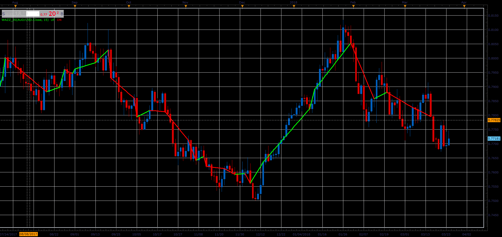

# Wama zigzag

> Source: https://fxcodebase.com/code/viewtopic.php?f=48&t=66096  
> Forum: 48 · Topic 66096 · 1 post(s)

---

## Wama zigzag

**Alexander.Gettinger** · Wed May 02, 2018 3:04 pm

The indicator takes on the basis of extremes of the Wama ([viewtopic.php?f=17&t=41293](https://fxcodebase.com/code/viewtopic.php?f=17&t=41293)).

 

Download:

 [wazz_JS.jsl](files/119048/wazz_JS.jsl)
