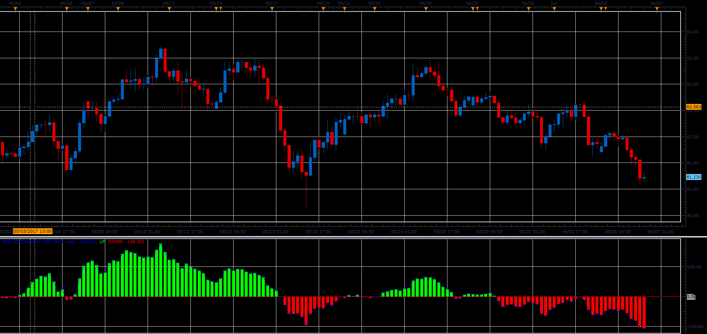

# Wave Segregation Index

> Source: https://fxcodebase.com/code/viewtopic.php?f=48&t=64897  
> Forum: 48 · Topic 64897 · 1 post(s)

---

## Wave Segregation Index

**Alexander.Gettinger** · Wed Jul 05, 2017 11:54 am

Formula:
WSI = (CCI[100]*TypicalPrice * ADX[100]) / 1000

Purpose of indicators is Elliot wave count.
The overbought & oversold lines for this indicator are +1.5 & -1.5

 

Download:

 [WSI_JS.jsl](files/113422/WSI_JS.jsl)
