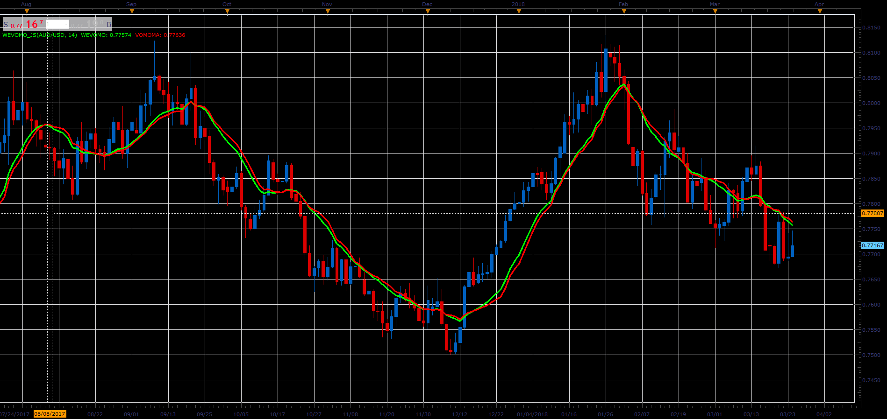

# Weight Volume Move-Adjusted Moving Average

> Source: https://fxcodebase.com/code/viewtopic.php?f=48&t=66097  
> Forum: 48 · Topic 66097 · 1 post(s)

---

## Weight Volume Move-Adjusted Moving Average

**Alexander.Gettinger** · Wed May 02, 2018 3:06 pm

As described in Article by Stephan Bisse from April 2005 issue of S & C Magazine

Formulas:
VOMOMA = (MOMA+VOMA)/2,
WEVOMO = (MOMA+VOMA+WMA)/3, where
MOMA[i] = (Close[i-Length+1]*Difference[i-Length+1]+Close[i-Length+2]*Difference[i-Length+2]+...+Close[i]*Difference[i])/Sum(Difference),
VOMA[i] = (Close[i-Length+1]*Volume[i-Length+1]+Close[i-Length+2]*Volume[i-Length+2]+...+Close[i]*Volume[i])/Sum(Volume),
WMA[i] = (Close[i-Length+1]*1+Close[i-Length+2]*2+...+Close[i]*Length)/LSum,
LSum = (Length+1)*Length/2,
Difference[i] = Abs(Close[i]-Close[i-1]),
Abs - absolute value.

 

Download:

 [WEVOMO_JS.jsl](files/119049/WEVOMO_JS.jsl)
