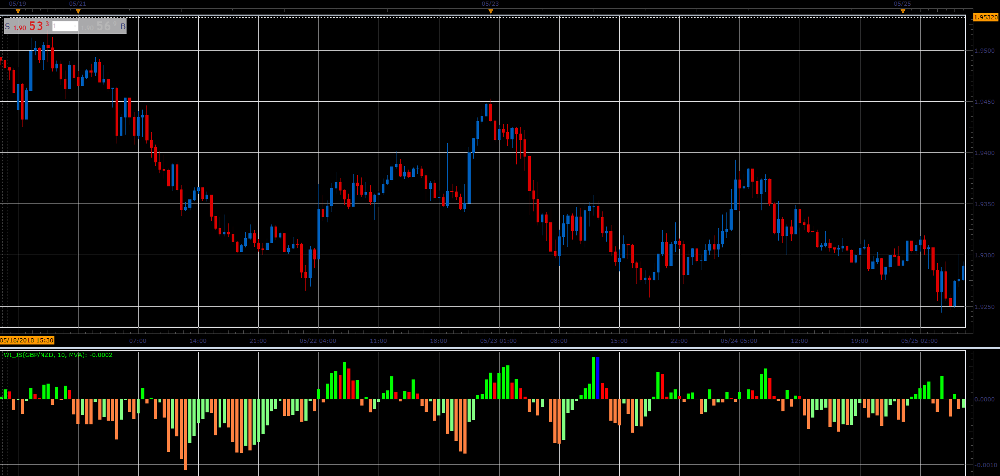

# WI oscillator

> Source: https://fxcodebase.com/code/viewtopic.php?f=48&t=66569  
> Forum: 48 · Topic 66569 · 1 post(s)

---

## WI oscillator

**Alexander.Gettinger** · Sun Aug 19, 2018 2:08 pm

WI is a Moving Average of (2*Close-High-Low).

 

Download:

 [wi_JS.jsl](files/120676/wi_JS.jsl)

For WI must be installed Averages indicator ([viewtopic.php?f=17&t=2430](https://fxcodebase.com/code/viewtopic.php?f=17&t=2430)).
