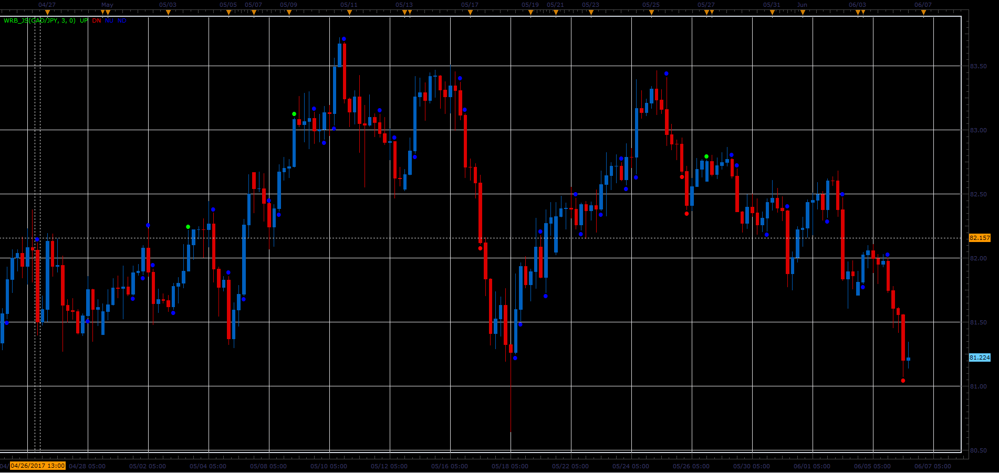

# Wide Range Body

> Source: https://fxcodebase.com/code/viewtopic.php?f=48&t=64893  
> Forum: 48 · Topic 64893 · 1 post(s)

---

## Wide Range Body

**Alexander.Gettinger** · Wed Jul 05, 2017 11:47 am

Wide Range Body is candles, whose body size is greater than body of previous three candles.
However, this indicator has the possibility of using other periods, not only third.
Distinguishes three types of WRB,
n consecutive up candles,
n consecutive down candles,
series of n candles with different orientation.

 

Download:

 [WRB_JS.jsl](files/113418/WRB_JS.jsl)
