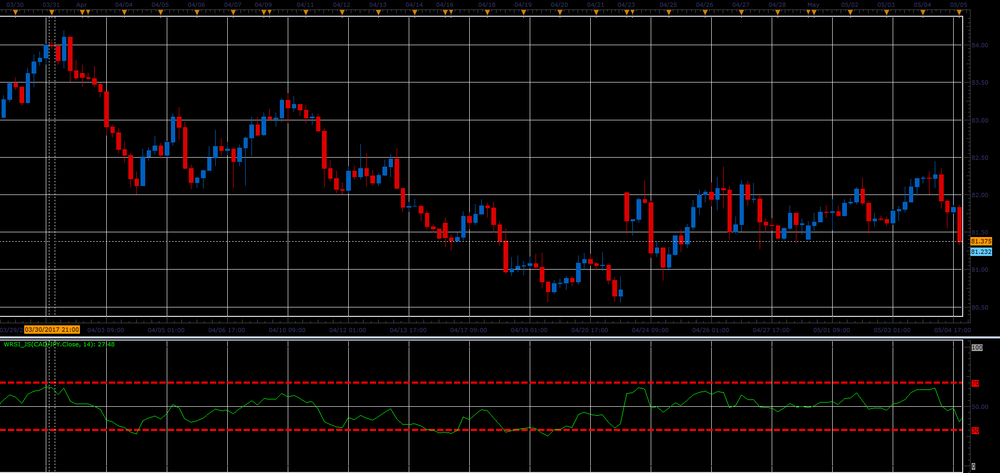

# Wilder's RSI

> Source: https://fxcodebase.com/code/viewtopic.php?f=48&t=64896  
> Forum: 48 · Topic 64896 · 1 post(s)

---

## Wilder's RSI

**Alexander.Gettinger** · Wed Jul 05, 2017 11:52 am

The formula for calculation is identical to that used in the calculation of the RSI.
Wilder's RSI uses Wilder moving average for smoothing.

 

Download:

 [WRSI_JS.jsl](files/113421/WRSI_JS.jsl)
