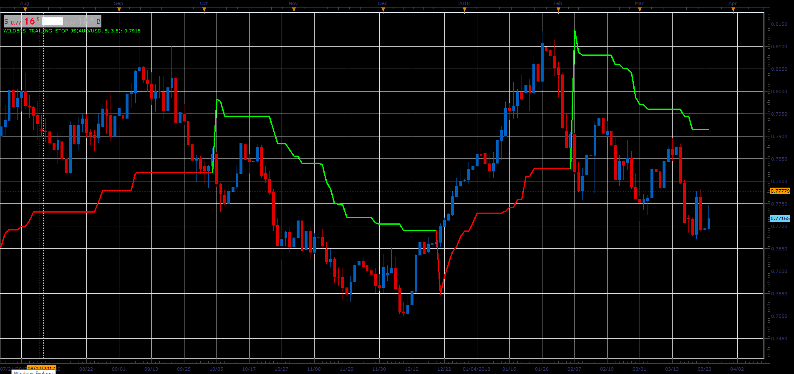

# Wilders Trailing Stop indicator

> Source: https://fxcodebase.com/code/viewtopic.php?f=48&t=66098  
> Forum: 48 · Topic 66098 · 1 post(s)

---

## Wilders Trailing Stop indicator

**Alexander.Gettinger** · Wed May 02, 2018 3:07 pm

Formulas:
WTS[i] = Max(WTS[i-1], Close[i]-loss), if Close[i]>WTS[i-1] and Close[i-1]>WTS[i-1],
WTS[i] = Min(WTS[i-1], Close[i]+loss), if Close[i]<WTS[i-1] and Close[i-1]<WTS[i-1],
WTS[i] = Close[i]-loss, if Close[i]>WTS[i-1],
WTS[i] = Close[i]+loss, in other cases, where
loss = Coeff*ATR,
ATR - Average True Range with Period.

 

Download:

 [Wilders_Trailing_Stop_JS.jsl](files/119050/Wilders_Trailing_Stop_JS.jsl)
