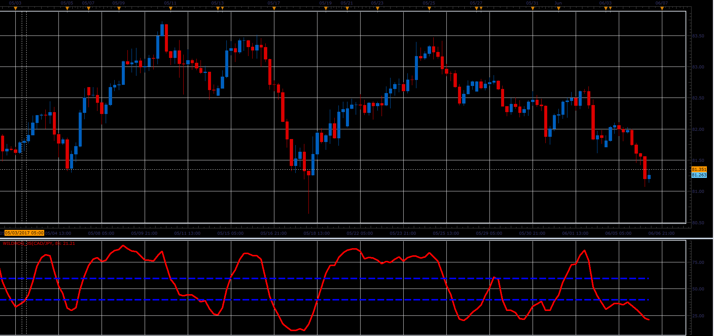

# Wildhog Oscillator

> Source: https://fxcodebase.com/code/viewtopic.php?f=48&t=64881  
> Forum: 48 · Topic 64881 · 1 post(s)

---

## Wildhog Oscillator

**Alexander.Gettinger** · Mon Jul 03, 2017 12:25 pm

Formula:
Wildhog[period] = ((((source.close[period]-min)/(max-min))*100)/3 )+ (Wildhog[period-1] / 3)*2.

 

Download:

 [Wildhog_JS.jsl](files/113374/Wildhog_JS.jsl)
