# William Blau's Indicators

> Source: https://fxcodebase.com/code/viewtopic.php?f=48&t=64882  
> Forum: 48 · Topic 64882 · 26 post(s)

---

## William Blau's Indicators

**Alexander.Gettinger** · Mon Jul 03, 2017 12:29 pm

**Blau Candlestick Index**

 

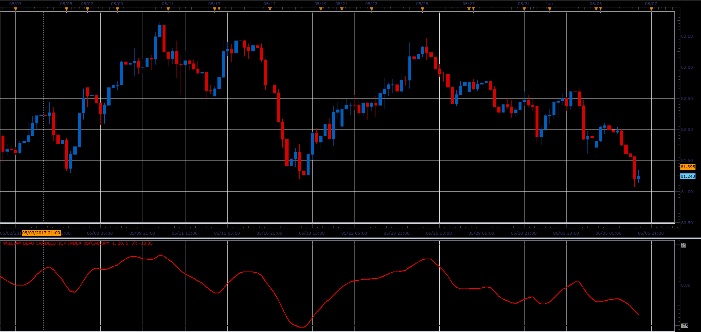

Download:

 [William Blau Candlestick Index_JS.jsl](files/113375/William%20Blau%20Candlestick%20Index_JS.jsl)

---

## Re: William Blau's Indicators

**Alexander.Gettinger** · Mon Jul 03, 2017 12:30 pm

**Blau Directional Trend Index**

 

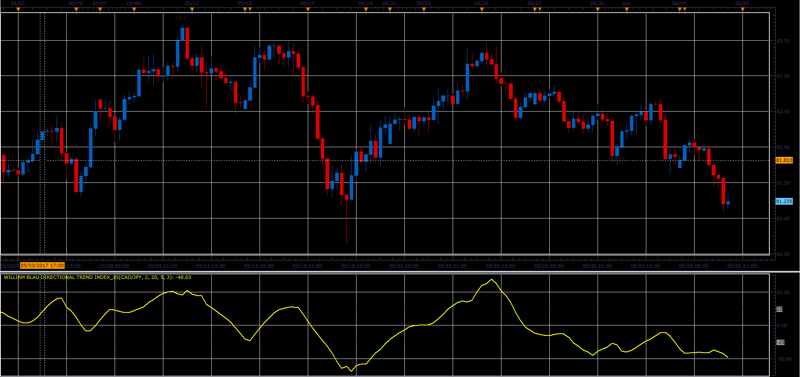

Download:

 [William Blau Directional Trend Index_JS.jsl](files/113376/William%20Blau%20Directional%20Trend%20Index_JS.jsl)

---

## Re: William Blau's Indicators

**Alexander.Gettinger** · Mon Jul 03, 2017 12:31 pm

**Blau Trend Momentum**

 

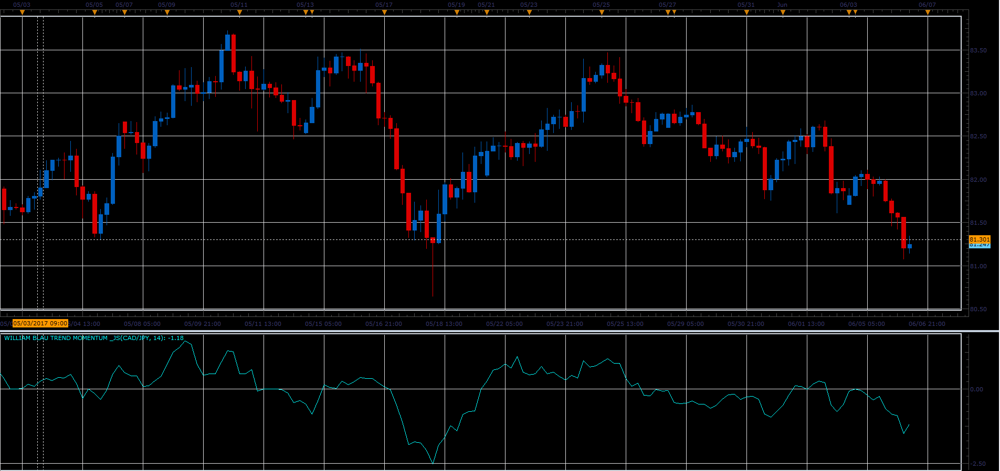

Download:

 [William Blau Trend Momentum _JS.jsl](files/113377/William%20Blau%20Trend%20Momentum%20_JS.jsl)

---

## Re: William Blau's Indicators

**Alexander.Gettinger** · Mon Jul 03, 2017 12:32 pm

**Blau True Strength Index**

 

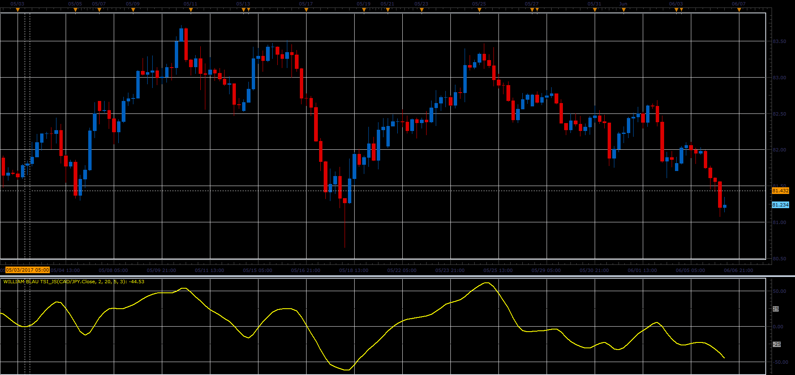

Download:

 [William Blau TSI_JS.jsl](files/113378/William%20Blau%20TSI_JS.jsl)

---

## Re: William Blau's Indicators

**Alexander.Gettinger** · Wed Apr 11, 2018 2:10 pm

**William Blau Candlestick Momentum Index:**

 

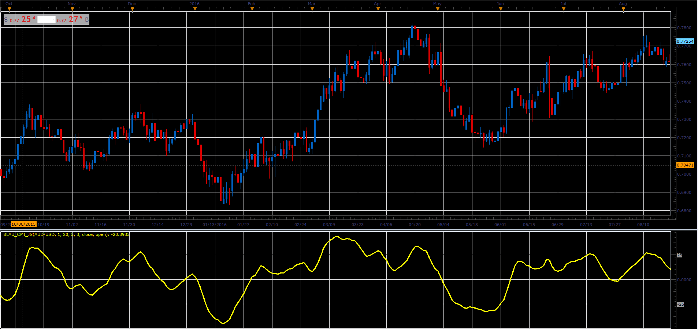

Download:

 [Blau_CMI_JS.jsl](files/118579/Blau_CMI_JS.jsl)

---

## Re: William Blau's Indicators

**Alexander.Gettinger** · Wed Apr 11, 2018 2:10 pm

**Blau_DTI:**

 

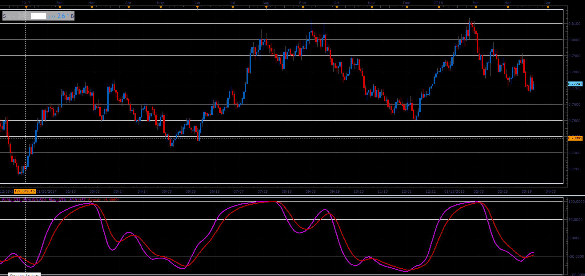

Download:

 [Blau_DTI_JS.jsl](files/118580/Blau_DTI_JS.jsl)

---

## Re: William Blau's Indicators

**Alexander.Gettinger** · Wed Apr 11, 2018 2:11 pm

**Blau Ergodic Candlestick Index:**

 

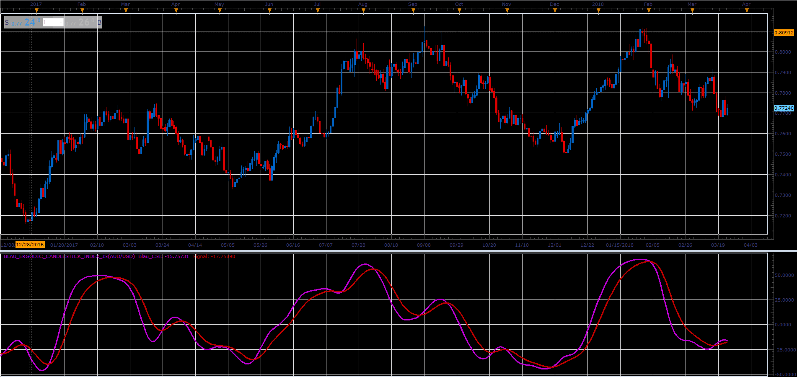

Download:

 [Blau_Ergodic_Candlestick_Index_JS.jsl](files/118581/Blau_Ergodic_Candlestick_Index_JS.jsl)

---

## Re: William Blau's Indicators

**Alexander.Gettinger** · Wed Apr 11, 2018 2:12 pm

**Blau Ergodic Oscillator:**

 

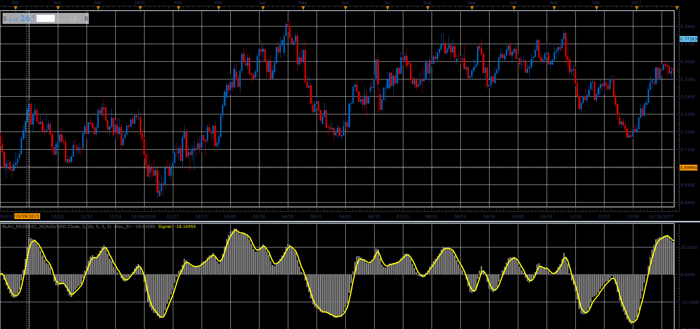

Download:

 [Blau_Ergodic_JS.jsl](files/118582/Blau_Ergodic_JS.jsl)

---

## Re: William Blau's Indicators

**Alexander.Gettinger** · Wed Apr 11, 2018 2:12 pm

**Blau Ergodic Candlestick Momentum Index:**

 

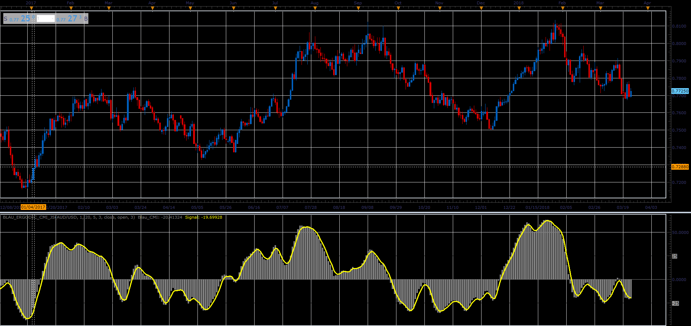

Download:

 [Blau_Ergodic_CMI_JS.jsl](files/118583/Blau_Ergodic_CMI_JS.jsl)

---

## Re: William Blau's Indicators

**Alexander.Gettinger** · Wed Apr 11, 2018 2:13 pm

**Blau Ergodic Candlestick Index:**

 

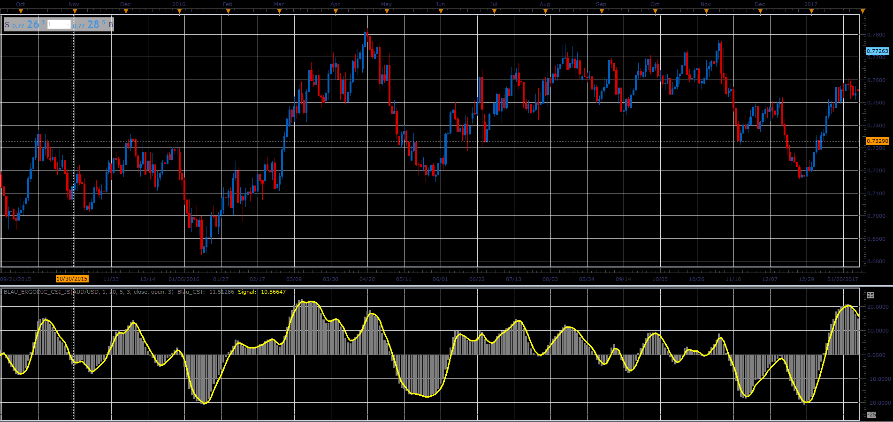

Download:

 [Blau_Ergodic_CSI_JS.jsl](files/118584/Blau_Ergodic_CSI_JS.jsl)

---

## Re: William Blau's Indicators

**Alexander.Gettinger** · Wed Apr 11, 2018 2:14 pm

**Blau Ergodic DTI-Oscillator:**

 

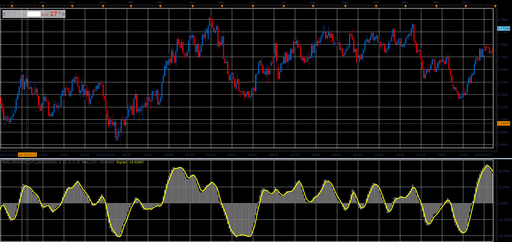

Download:

 [Blau_Ergodic_DTI_JS.jsl](files/118585/Blau_Ergodic_DTI_JS.jsl)

---

## Re: William Blau's Indicators

**Alexander.Gettinger** · Wed Apr 11, 2018 2:14 pm

**Blau Ergodic MACD:**

 

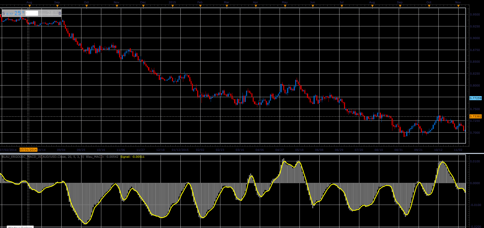

Download:

 [Blau_Ergodic_MACD_JS.jsl](files/118586/Blau_Ergodic_MACD_JS.jsl)

---

## Re: William Blau's Indicators

**Alexander.Gettinger** · Wed Apr 11, 2018 2:15 pm

**Blau Ergodic MDI oscillator:**

 

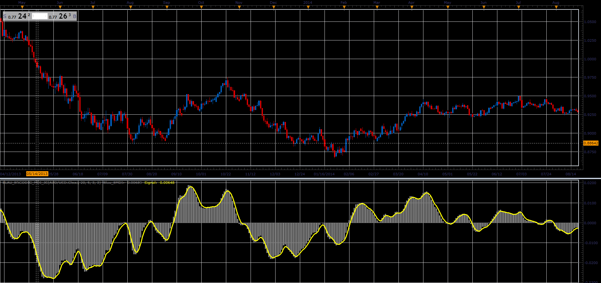

Download:

 [Blau_Ergodic_MDI_JS.jsl](files/118587/Blau_Ergodic_MDI_JS.jsl)

---

## Re: William Blau's Indicators

**Alexander.Gettinger** · Wed Apr 11, 2018 2:16 pm

**Blau Composite High-Low Momentum:**

 

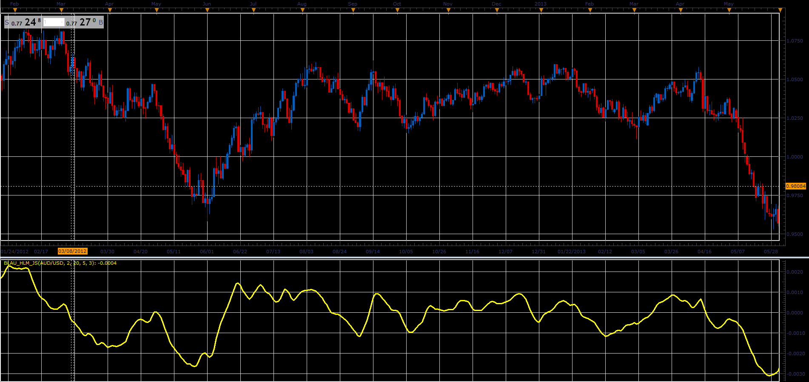

Download:

 [Blau_HLM_JS.jsl](files/118588/Blau_HLM_JS.jsl)

---

## Re: William Blau's Indicators

**Alexander.Gettinger** · Wed Apr 11, 2018 2:17 pm

**Blau MACD:**

 

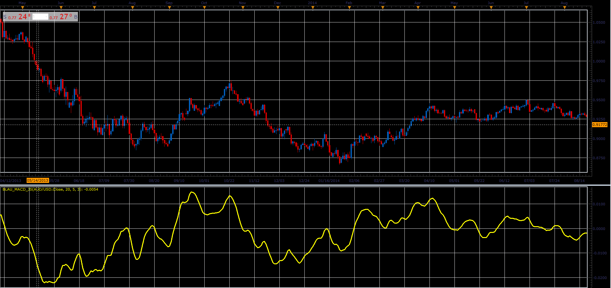

Download:

 [Blau_MACD_JS.jsl](files/118589/Blau_MACD_JS.jsl)

---

## Re: William Blau's Indicators

**Alexander.Gettinger** · Wed Apr 11, 2018 2:17 pm

**Blau Mean Deviation Index:**

 

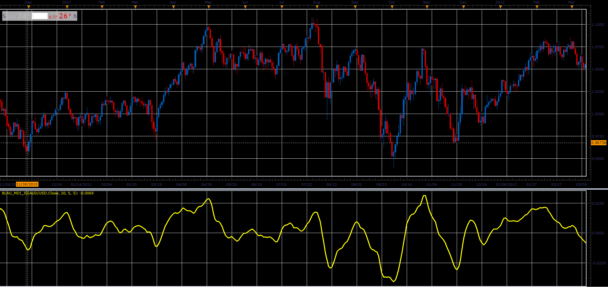

Download:

 [Blau_MDI_JS.jsl](files/118590/Blau_MDI_JS.jsl)

---

## Re: William Blau's Indicators

**Alexander.Gettinger** · Wed Apr 11, 2018 2:18 pm

**Blau Momentum oscillator:**

 

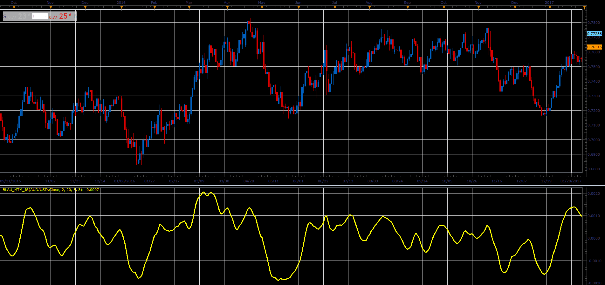

Download:

 [Blau_Mtm_JS.jsl](files/118591/Blau_Mtm_JS.jsl)

---

## Re: William Blau's Indicators

**Alexander.Gettinger** · Wed Apr 11, 2018 2:18 pm

**Blau Stochastic Momentum:**

 

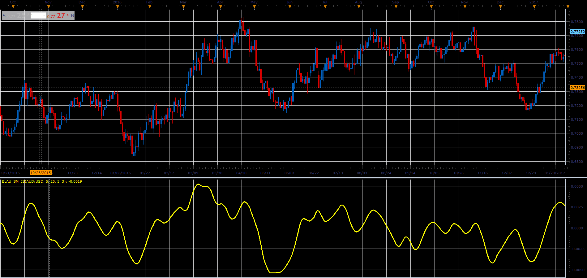

Download:

 [Blau_SM_JS.jsl](files/118592/Blau_SM_JS.jsl)

---

## Re: William Blau's Indicators

**Alexander.Gettinger** · Wed Apr 11, 2018 2:19 pm

**Blau Stochastic Momentum oscillator:**

 

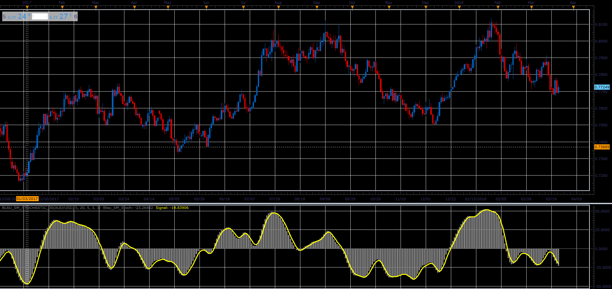

Download:

 [Blau_SM_Stochastic_JS.jsl](files/118593/Blau_SM_Stochastic_JS.jsl)

---

## Re: William Blau's Indicators

**Alexander.Gettinger** · Wed Apr 11, 2018 2:19 pm

**Blau Stochastic Momentum Index:**

 

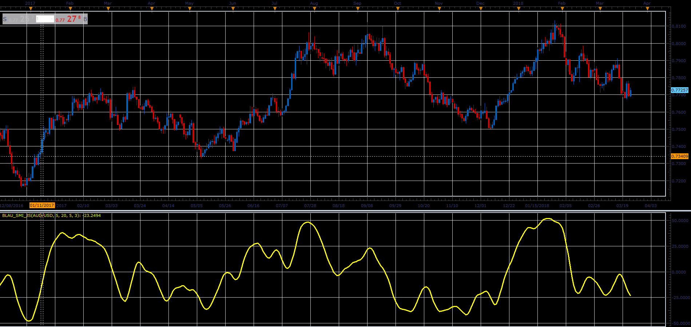

Download:

 [Blau_SMI_JS.jsl](files/118594/Blau_SMI_JS.jsl)

---

## Re: William Blau's Indicators

**Alexander.Gettinger** · Wed Apr 11, 2018 2:20 pm

**Blau Stochastic Index oscillator:**

 

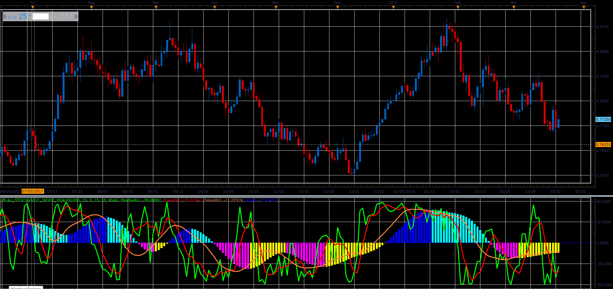

Download:

 [Blau_Stochastic_Index_JS.jsl](files/118595/Blau_Stochastic_Index_JS.jsl)

---

## Re: William Blau's Indicators

**Alexander.Gettinger** · Wed Apr 11, 2018 2:21 pm

**Blau Stochastic oscillator:**

 

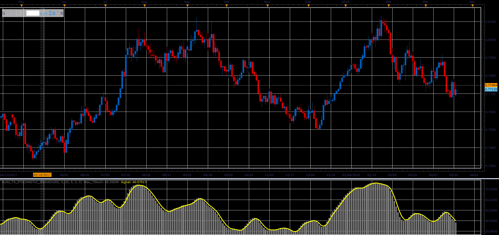

Download:

 [Blau_TS_Stochastic_JS.jsl](files/118596/Blau_TS_Stochastic_JS.jsl)

---

## Re: William Blau's Indicators

**Alexander.Gettinger** · Wed Apr 11, 2018 2:22 pm

**Blau Stochastic:**

 

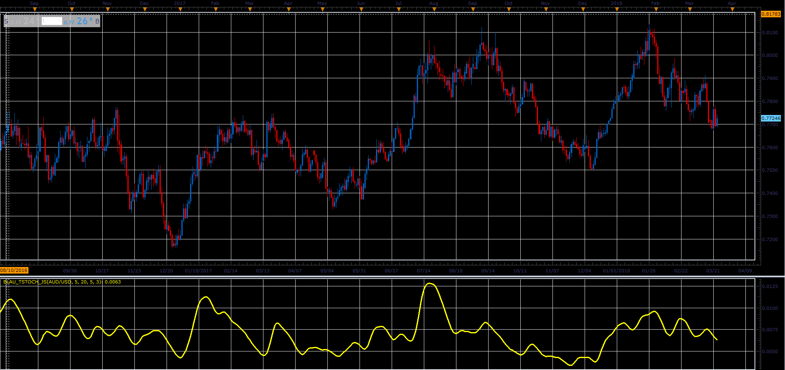

Download:

 [Blau_TStoch_JS.jsl](files/118597/Blau_TStoch_JS.jsl)

---

## Re: William Blau's Indicators

**logicgate** · Mon Jan 21, 2019 2:52 pm

Dear friend, can you please compile a modded SMI (stochastic momentum index) for MT4 using smoothed VWMA (volume weighted moving averages) instead of EMAs?

(there is a smoothed volume weighted moving average compiled by apprentice here in the forum).

---

## Re: William Blau's Indicators

**Apprentice** · Tue Jan 29, 2019 5:00 pm

Your request is added to the development list under Id Number 4446

---

## Re: William Blau's Indicators

**Apprentice** · Fri Feb 01, 2019 6:30 am

Try this version.
[viewtopic.php?f=38&t=60201&p=123638#p123638](https://fxcodebase.com/code/viewtopic.php?f=38&t=60201&p=123638#p123638)
