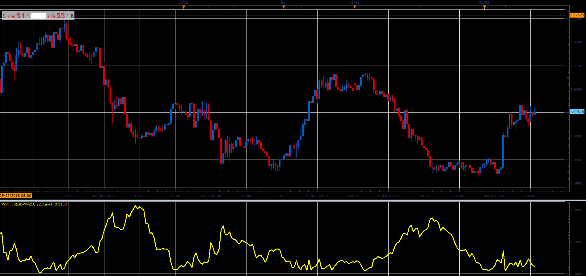

# William Vix Fix indicator and WVF Stochastic

> Source: https://fxcodebase.com/code/viewtopic.php?f=48&t=66470  
> Forum: 48 · Topic 66470 · 1 post(s)

---

## William Vix Fix indicator and WVF Stochastic

**Alexander.Gettinger** · Tue Aug 07, 2018 12:19 pm

**William Vix Fix indicator:**

William’s VIX Fix is a synthetic VIX (CBOE Volatility Index) calculation which can be used in any market to mimic the performance (but not the quotes) of the well-known volatility index (the WVF is not based on option’s implied volatility but derived from historical and intraday prices only).
William’s original formula:
WVF = [Highest (Close,22) - Low) / (Highest(Close,22)] * 100

 

Download:

 [WVF_JS.jsl](files/120427/WVF_JS.jsl)

**WVF Stochastic:**

Formulas:
K = 100*mins/maxes,
D = MVA(K) with [Stochastic_D_Length] number of periods, where
mins = WVF - minLow,
maxes = maxHigh - minLow,
minLow, maxHigh - minimum and maximum values of WVF at range from (i-Stochastic_K_Length+1) to (i),
WVF = 100*(Max-Low)/Max,
Max - highest close price at range from (i-WVF_Length+1) to (i).

 

Download:

 [WVF Stochastic_JS.jsl](files/120427/WVF%20Stochastic_JS.jsl)
