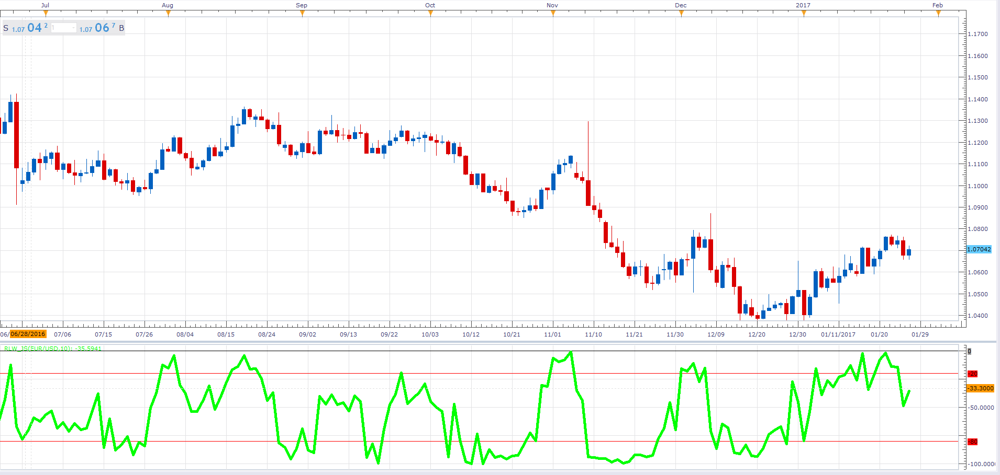

# Williams Percent Range

> Source: https://fxcodebase.com/code/viewtopic.php?f=48&t=64356  
> Forum: 48 · Topic 64356 · 1 post(s)

---

## Williams Percent Range

**Alexander.Gettinger** · Fri Jan 27, 2017 11:51 am

Williams Percent Range (RLW) is a dynamic technical indicator, which determines whether the market is overbought/oversold.

 

Download:

 [RLW_JS.jsl](files/110748/RLW_JS.jsl)
