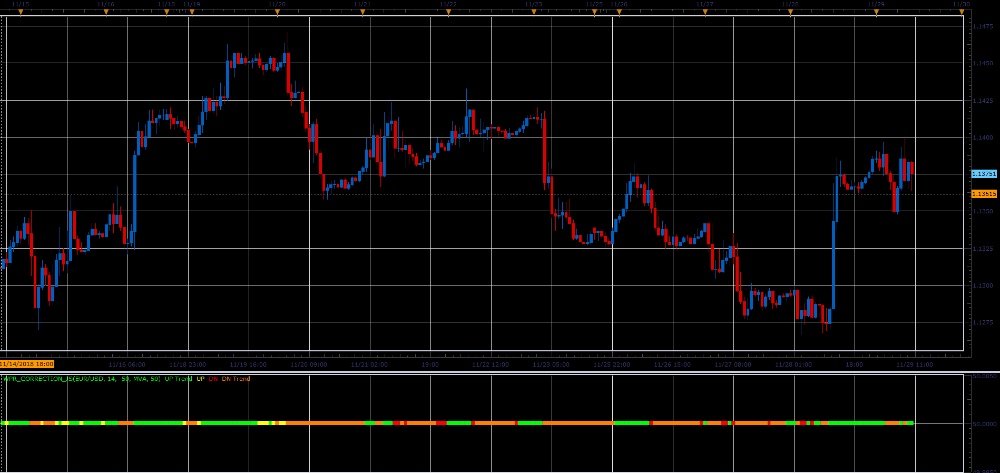

# Williams % R Oscillator correction

> Source: https://fxcodebase.com/code/viewtopic.php?f=48&t=67119  
> Forum: 48 · Topic 67119 · 1 post(s)

---

## Williams % R Oscillator correction

**Alexander.Gettinger** · Fri Dec 07, 2018 3:24 pm

Formulas:
If Williams %R (WPR_Period) > WPR_Level And Williams %R > MA(MA_Method, MA_Period) of Williams % R = Trend Up
If Williams %R > WPR_Level And Williams %R < MA of Williams % R = Up
If Williams %R < WPR_Level And Williams %R < MA of Williams % R = Trend Down
If Williams %R < WPR_Level And Williams %R > MA of Williams % R = Down

 

Download:

 [WPR_Correction_JS.jsl](files/122630/WPR_Correction_JS.jsl)
