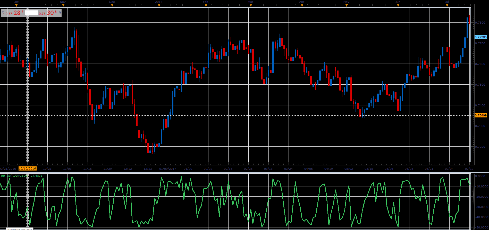

# Williams Rendiment oscillator

> Source: https://fxcodebase.com/code/viewtopic.php?f=48&t=66081  
> Forum: 48 · Topic 66081 · 1 post(s)

---

## Williams Rendiment oscillator

**Alexander.Gettinger** · Wed May 02, 2018 2:44 pm

Formula:
%RR= ( (%R Williams) + ( Rendiment) ) / 2

1) %R williams is the indicator of Larry Williams
%R = (Highest High - Close)/(Highest High - Lowest Low) * -100

2) Rendiment= X * natural logarithm (Close1/Close2)

close1= close of previous candelstick
close2= close of candelstick N periods ago

 

Download:

 [RR_JS.jsl](files/119033/RR_JS.jsl)
