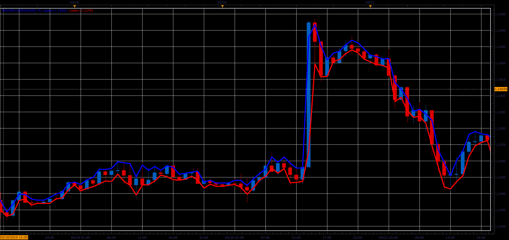

# WiOver indicator

> Source: https://fxcodebase.com/code/viewtopic.php?f=48&t=68249  
> Forum: 48 · Topic 68249 · 1 post(s)

---

## WiOver indicator

**Alexander.Gettinger** · Sat Mar 30, 2019 2:58 pm

The indicator shows the average percentage value of the last candlesticks overlap. It is useful for those, who enters the market manually using limit orders during price consolidation, as it allows to select order direction. Blue line - recommended BUY-LIMIT, red one - SELL-LIMIT.

 

Download:

 [WiOver_JS.jsl](files/125469/WiOver_JS.jsl)
