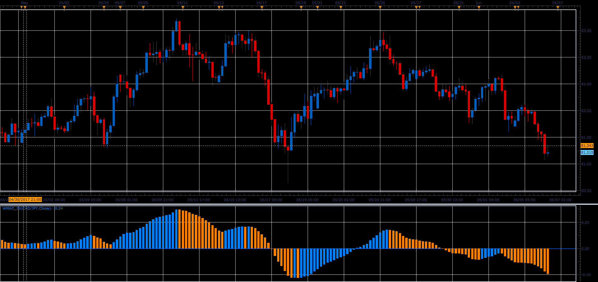

# WMA Oscillator

> Source: https://fxcodebase.com/code/viewtopic.php?f=48&t=64885  
> Forum: 48 · Topic 64885 · 1 post(s)

---

## WMA Oscillator

**Alexander.Gettinger** · Mon Jul 03, 2017 12:38 pm

Formula:
WMAO [i] = Wilders MA(Short_Length) - Wilders MA(Long_Length).

 

Download:

 [WMAO_JS.jsl](files/113381/WMAO_JS.jsl)
