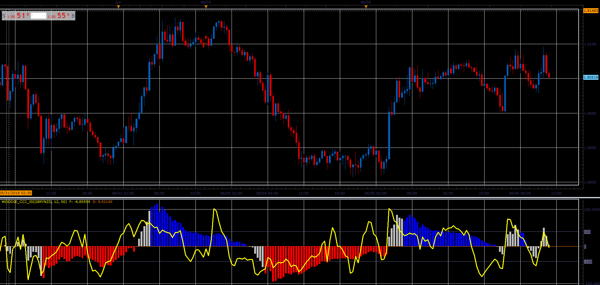

# WOODIE CCI

> Source: https://fxcodebase.com/code/viewtopic.php?f=48&t=66570  
> Forum: 48 · Topic 66570 · 1 post(s)

---

## WOODIE CCI

**Alexander.Gettinger** · Sun Aug 19, 2018 2:10 pm

The indicator shows fast and slow CCI and also highlights neutral zone for the slow CCI for the first N periods after the slow CCI crosses zero.

Use it when the compatibility is problem.

 

Download:

 [WOODIE_CCI_JS.jsl](files/120677/WOODIE_CCI_JS.jsl)
