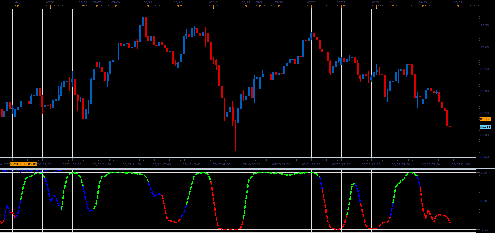

# WPR_FO indicator

> Source: https://fxcodebase.com/code/viewtopic.php?f=48&t=64890  
> Forum: 48 · Topic 64890 · 1 post(s)

---

## WPR_FO indicator

**Alexander.Gettinger** · Wed Jul 05, 2017 11:40 am

Formula:
WPR_FO=(Exp(2*MA)-1)/(Exp(2*MA)+1), where
MA is a moving average of [0.1*(RLW+50)],
RLW - Williams Percent Range.

 

Download:

 [WPR_FO_JS.jsl](files/113415/WPR_FO_JS.jsl)
