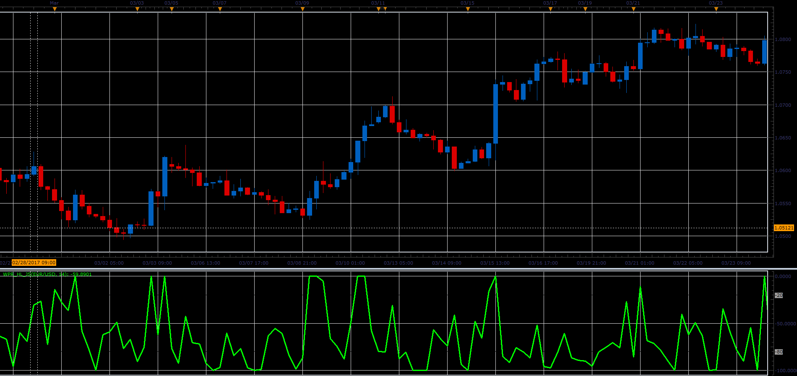

# WPR_HL oscillator

> Source: https://fxcodebase.com/code/viewtopic.php?f=48&t=64749  
> Forum: 48 · Topic 64749 · 1 post(s)

---

## WPR_HL oscillator

**Alexander.Gettinger** · Mon Jun 05, 2017 11:36 am

The oscillator represents the Williams’ Percent Range calculated on the (High-Low).

Formula:
WPR_HL[i]=-100*(Max-HL[i])/(Max-Min), where
HL[i]=High[i]-Low[i],
Max and Min - maximum and minimum prices at range from (i-Period) to (i).

 

Download:

 [WPR_HL_JS.jsl](files/112760/WPR_HL_JS.jsl)
