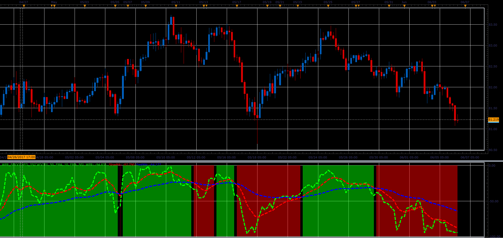

# WPR Smoothed indicator

> Source: https://fxcodebase.com/code/viewtopic.php?f=48&t=64891  
> Forum: 48 · Topic 64891 · 1 post(s)

---

## WPR Smoothed indicator

**Alexander.Gettinger** · Wed Jul 05, 2017 11:43 am

Formulas:

If Slow MA of Williams Percent Range (WPR)>Fast MA of Williams Percent Range (WPR): Up trend,
If Slow MA of Williams Percent Range (WPR)<Fast MA of Williams Percent Range (WPR): Down trend.

 

Download:

 [WPR_Smoothed_JS.jsl](files/113416/WPR_Smoothed_JS.jsl)

For successful work must be installed two indicators:
1. Williams Percent Range (WPR): [viewtopic.php?f=17&t=898](https://fxcodebase.com/code/viewtopic.php?f=17&t=898)
2. Moving Average Indicator: 20 in 1: [viewtopic.php?f=17&t=2430](https://fxcodebase.com/code/viewtopic.php?f=17&t=2430)
