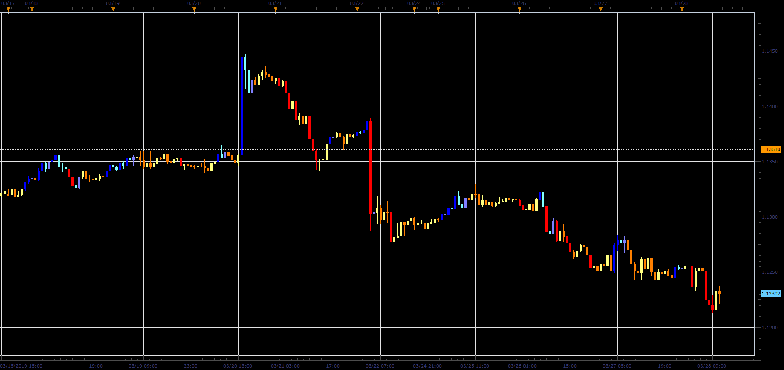

# X Bar Clear Close Trend indicator

> Source: https://fxcodebase.com/code/viewtopic.php?f=48&t=68283  
> Forum: 48 · Topic 68283 · 1 post(s)

---

## X Bar Clear Close Trend indicator

**Alexander.Gettinger** · Sat Mar 30, 2019 4:43 pm

To define the trend reversal, the indicator does not use any Moving Averages, or parameters connected with the distance passed by the price. The only criteria is the breakthrough of maximums / minimums of the previous bars.

 

Download:

 [XBarClearCloseTrend_JS.jsl](files/125505/XBarClearCloseTrend_JS.jsl)
