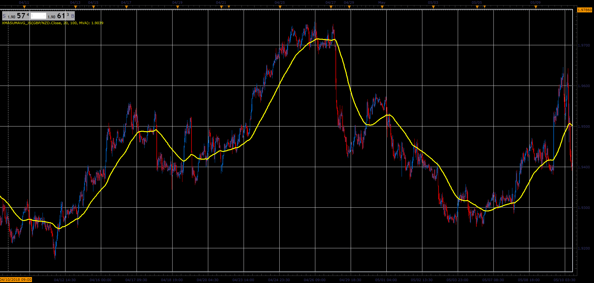

# X MA Sum Average

> Source: https://fxcodebase.com/code/viewtopic.php?f=48&t=66572  
> Forum: 48 · Topic 66572 · 1 post(s)

---

## X MA Sum Average

**Alexander.Gettinger** · Sun Aug 19, 2018 2:11 pm

XMaSumAvgSum or XMA Averages calculated Average as the average of All moving averages from Start-End Range.

XMA = (MA[Start] + MA[Start+1] + .... + MA[End] )/ (End-Start+1)

 

Download:

 [xMaSumAvg_JS.jsl](files/120679/xMaSumAvg_JS.jsl)
