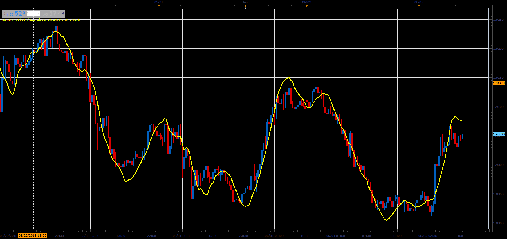

# XdinMA indicator

> Source: https://fxcodebase.com/code/viewtopic.php?f=48&t=66471  
> Forum: 48 · Topic 66471 · 1 post(s)

---

## XdinMA indicator

**Alexander.Gettinger** · Tue Aug 07, 2018 12:22 pm

Formula:
XdinMA=K*MA(MainPeriod)-(K-1)*MA(PlusPeriod).

 

Download:

 [XdinMA_JS.jsl](files/120428/XdinMA_JS.jsl)

For this indicator must be installed Averages indicator ([viewtopic.php?f=17&t=2430](https://fxcodebase.com/code/viewtopic.php?f=17&t=2430)).
