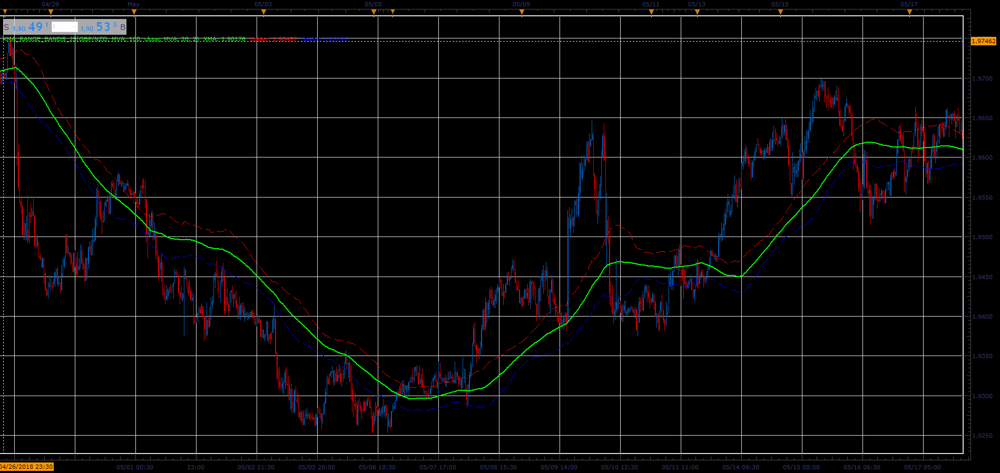

# XMA Range Bands

> Source: https://fxcodebase.com/code/viewtopic.php?f=48&t=66473  
> Forum: 48 · Topic 66473 · 1 post(s)

---

## XMA Range Bands

**Alexander.Gettinger** · Tue Aug 07, 2018 12:26 pm

Formulas:
XMA=MA(Price),
Upper=XMA+MA(Range),
Lower=XMA-MA(Range), where
Range=High-Low.

 

Download:

 [XMA_Range_Bands_JS.jsl](files/120430/XMA_Range_Bands_JS.jsl)

For this indicator must be installed Averages indicator ([viewtopic.php?f=17&t=2430](https://fxcodebase.com/code/viewtopic.php?f=17&t=2430)).
