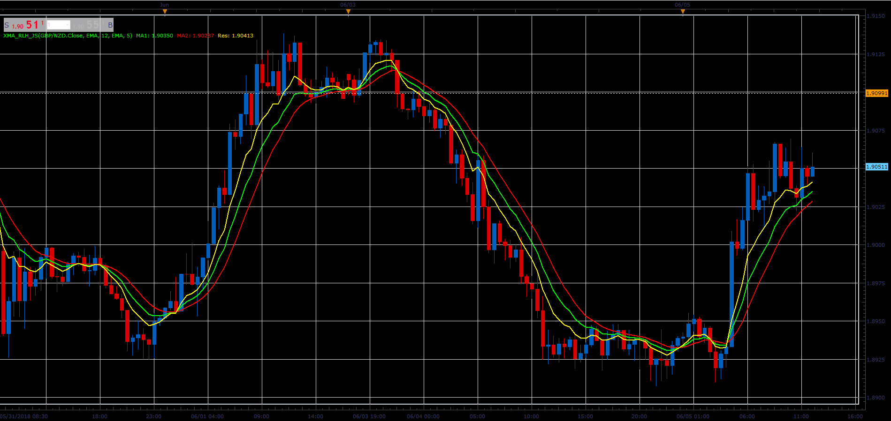

# XMA_RLH indicator

> Source: https://fxcodebase.com/code/viewtopic.php?f=48&t=66474  
> Forum: 48 · Topic 66474 · 1 post(s)

---

## XMA_RLH indicator

**Alexander.Gettinger** · Tue Aug 07, 2018 12:27 pm

Formula:
XMA_RLH=2*MA1(Price)-MA2(Price).

 

Download:

 [XMA_RLH_JS.jsl](files/120431/XMA_RLH_JS.jsl)

For this indicator must be installed Averages indicator ([viewtopic.php?f=17&t=2430](https://fxcodebase.com/code/viewtopic.php?f=17&t=2430)).
