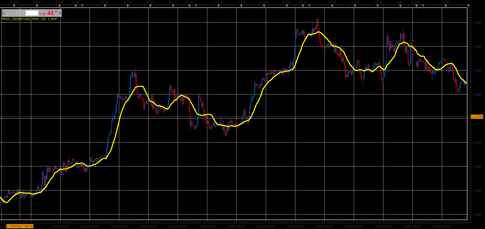

# XMUV indicator

> Source: https://fxcodebase.com/code/viewtopic.php?f=48&t=65606  
> Forum: 48 · Topic 65606 · 1 post(s)

---

## XMUV indicator

**Alexander.Gettinger** · Sat Jan 06, 2018 6:44 pm

Formulas:
XMUV = MA(P), where
P = (2*x-Low-High)/2,
x = (High+Close+2*Low)/2, if Close<Open,
x = (Low+Close+2*High)/2, if Close>Open,
x = (High+Low+2*Close)/2, if Close=Open.

 

Download:

 [XMUV_JS.jsl](files/116885/XMUV_JS.jsl)
