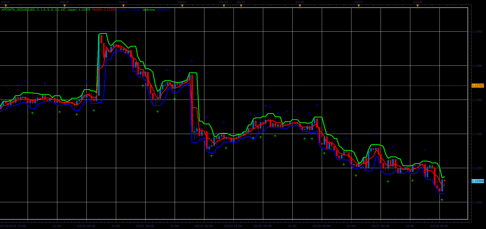

# XPoints indicator

> Source: https://fxcodebase.com/code/viewtopic.php?f=48&t=68284  
> Forum: 48 · Topic 68284 · 1 post(s)

---

## XPoints indicator

**Alexander.Gettinger** · Sat Mar 30, 2019 4:44 pm

Formulas:
Upper[i] - maximum price at range from (i-Period+1) to i,
Lower[i] - minimum price at range from (i-Period+1) to i,
Middle[i] = (Upper[i]+Lower[i])/2,
if Low[i-1]<=Lower[i-1] and High[i-1]<Upper[i-1] and Low[i]>=Low[i-1]+xslope and [(Open[i-1]+Close[i-1])/2<=Middle[i-1] or (Open[i]+Close[i])/2>=(Open[i-1]+Close[i-1])/2+xslope or (High[i]+Low[i])/2>=(High[i-1]+Low[i-1])/2+xslope then UpArrow,
if High[i-1]>=Upper[i-1] and Low[i-1]>Lower[i-1] and High[i]<=High[i-1]-xslope and [(Open[i-1]+Close[i-1])/2>=Middle[i-1] or (Open[i]+Close[i])/2<=(Open[i-1]+Close[i-1])/2-xslope or (High[i]+Low[i])/2<=(High[i-1]+Low[i-1])/2-xslope then DnArrow.

 

Download:

 [XPoints_JS.jsl](files/125506/XPoints_JS.jsl)
