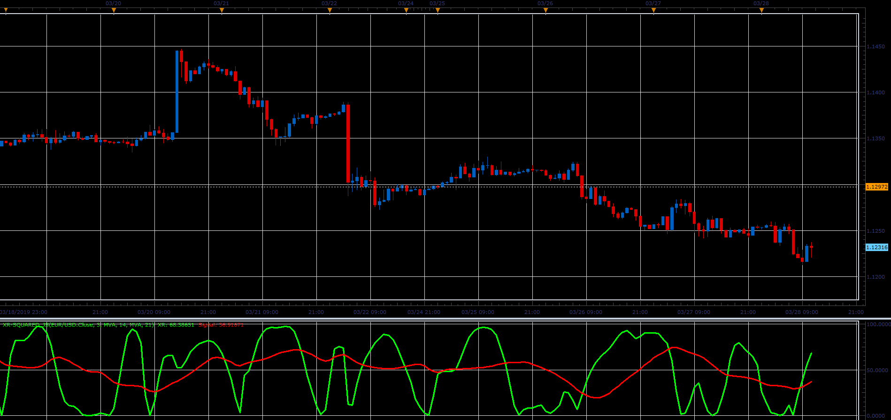

# XR-squared oscillator

> Source: https://fxcodebase.com/code/viewtopic.php?f=48&t=68285  
> Forum: 48 · Topic 68285 · 1 post(s)

---

## XR-squared oscillator

**Alexander.Gettinger** · Sat Mar 30, 2019 4:46 pm

XR-Squared indicator uses linear regression to determine the presence or absence of a market trend.

 

Download:

 [XR-squared_JS.jsl](files/125507/XR-squared_JS.jsl)
