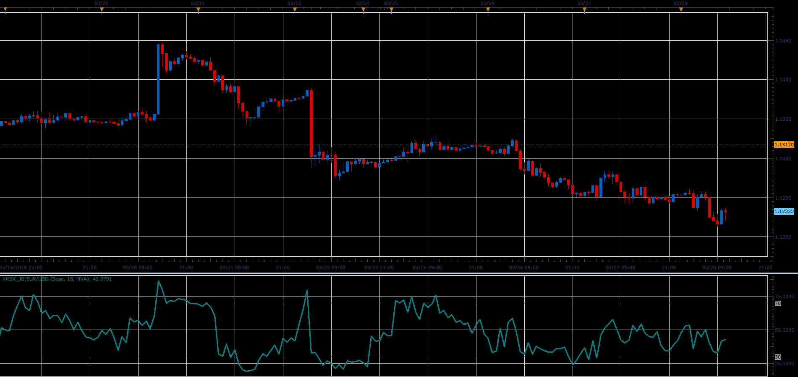
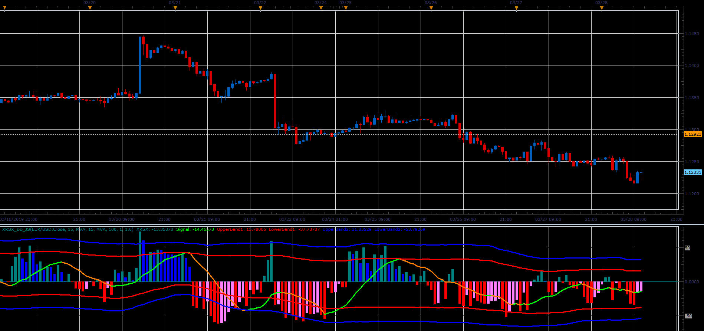

# XRSX indicators

> Source: https://fxcodebase.com/code/viewtopic.php?f=48&t=68286  
> Forum: 48 · Topic 68286 · 1 post(s)

---

## XRSX indicators

**Alexander.Gettinger** · Sat Mar 30, 2019 4:48 pm

Formulas:
XRSX=(DMA/AbsDMA)*50+50, where
DMA-moving average for DPrice,
AbsDMA-moving average for AbsDPrice,
DPrice[i]=Price[i]-Price[i-1],
AbsDPrice[i]=Abs(Price[i]-Price[i-1]).

XRSX_BB - indicator with signal line and bands.

**XRSX:**

 

Download:

 [XRSX_JS.jsl](files/125508/XRSX_JS.jsl)

**XRSX_BB:**

 

Download:

 [XRSX_BB_JS.jsl](files/125508/XRSX_BB_JS.jsl)
