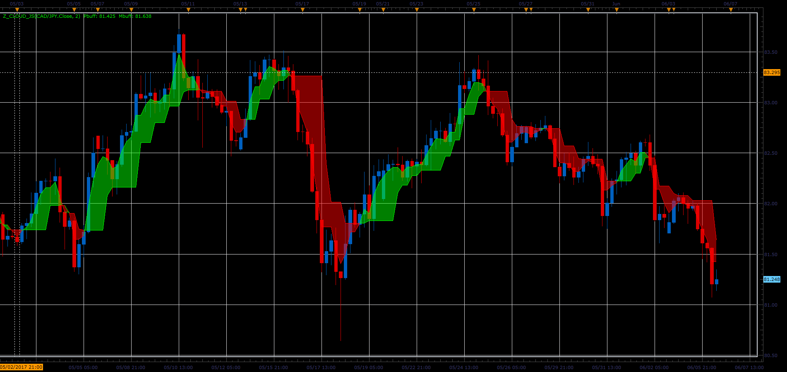

# Z cloud indicator

> Source: https://fxcodebase.com/code/viewtopic.php?f=48&t=64898  
> Forum: 48 · Topic 64898 · 1 post(s)

---

## Z cloud indicator

**Alexander.Gettinger** · Wed Jul 05, 2017 11:55 am

Formulas:
Pbuff[i] = Pbuff[i-1]+(Price[i]-Pbuff[i-1])/ki,
Mbuff[i] = Mbuff[i-1]+(Price[i]-Mbuff[i-1])/ki.

 

Download:

 [Z_Cloud_JS.jsl](files/113423/Z_Cloud_JS.jsl)
