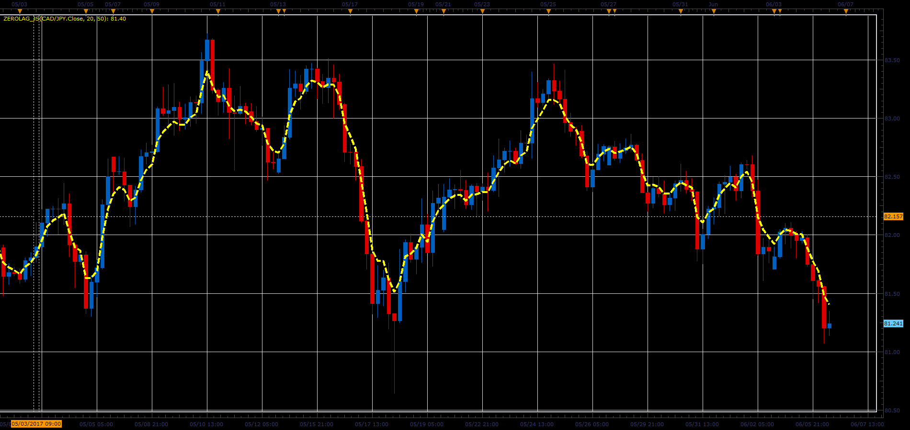

# Zero Lag indicator

> Source: https://fxcodebase.com/code/viewtopic.php?f=48&t=64825  
> Forum: 48 · Topic 64825 · 1 post(s)

---

## Zero Lag indicator

**Alexander.Gettinger** · Fri Jun 23, 2017 2:36 pm

Zero Lag indicator is described in November 2010 issue of Stocks & Commodities.

The formula of the indicator is:
ZL = α * (EMA + Gain * (Close - ZL[1])) + (1 - α) * ZL[1]

The formula is similar to EMA, except that new term Gain * (Close - ZL[1]) is introduced.
'Gain' represents the value which is chosen from [-GainLimit, GainLimit] interval to minimize
the error for current data sample, (Close - ZL) → min

 

Download:

 [ZeroLag_JS.jsl](files/113082/ZeroLag_JS.jsl)
