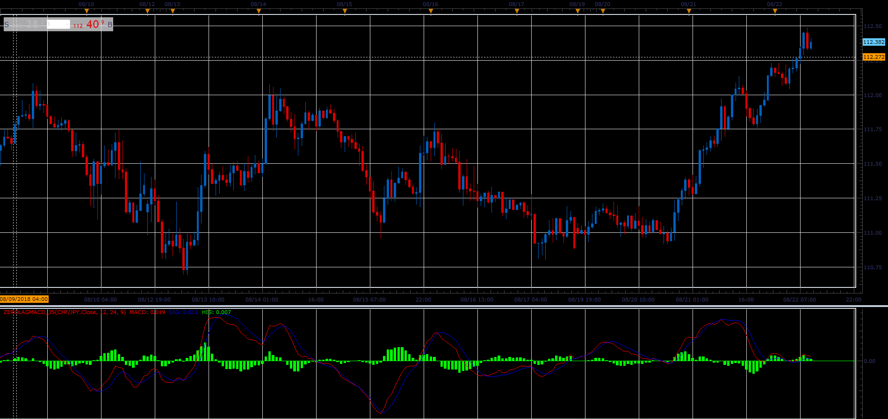

# Zero Lag MACD

> Source: https://fxcodebase.com/code/viewtopic.php?f=48&t=67004  
> Forum: 48 · Topic 67004 · 1 post(s)

---

## Zero Lag MACD

**Alexander.Gettinger** · Sat Nov 24, 2018 5:45 pm

Zero Lag MACD is initially introduced in the Stock & Commodities in 2000.

This version of MACD has much smaller delay in comparison with classic MACD.

Formula:
MACD = (2 * EMA(price, FAST) - EMA(EMA(price, FAST), FAST)) - (2 * EMA(price, SLOW) - EMA(EMA(price, SLOW), SLOW))
SIGNAL = 2 * EMA(MACD, SIG) - EMA(EMA(MACD, SIG), SIG))
HISTOGRAM = MACD - SIGNAL

 

Download:

 [ZeroLagMACD_JS.jsl](files/122333/ZeroLagMACD_JS.jsl)
