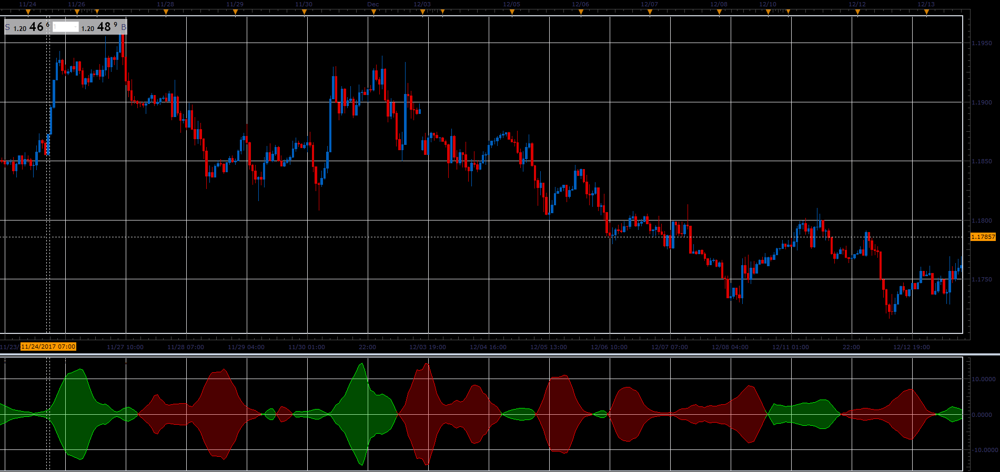

# Zero Point Force

> Source: https://fxcodebase.com/code/viewtopic.php?f=48&t=65608  
> Forum: 48 · Topic 65608 · 1 post(s)

---

## Zero Point Force

**Alexander.Gettinger** · Sat Jan 06, 2018 6:46 pm

Formula:
ZPF = V*(S-L)/2, where
V = MA(Volume) with [Volume_Length] number of periods and [Volume_Method] type,
S = MA(Close) with [Short_Length] number of periods and [Short_Method] type,
L = MA(Close) with [Long_Length] number of periods and [Long_Method] type.

 

Download:

 [ZPF_JS.jsl](files/116887/ZPF_JS.jsl)
