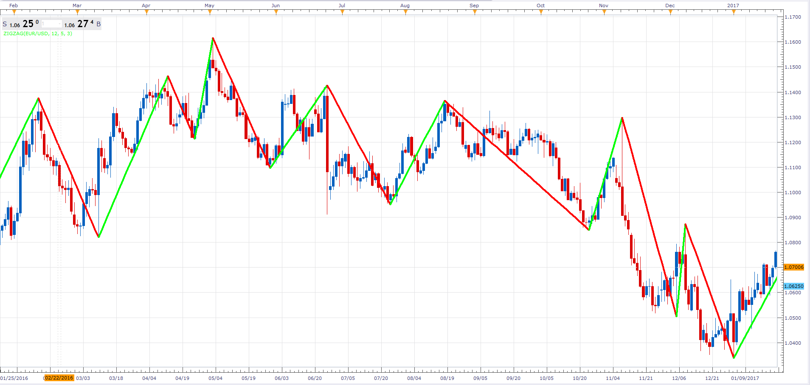

# ZigZag

> Source: https://fxcodebase.com/code/viewtopic.php?f=48&t=64445  
> Forum: 48 · Topic 64445 · 3 post(s)

---

## ZigZag

**Alexander.Gettinger** · Fri Feb 10, 2017 7:59 pm

ZigZag.

 

Download:

 [Zigzag_JS.jsl](files/111012/Zigzag_JS.jsl)

---

## Re: ZigZag

**Ciobin** · Mon Mar 06, 2017 3:30 pm

Sorry, but in the TradingStation(DEV)/Marketscope 2.0,
I have not the estention "*.JSL"

How to import the indicator develped in JScript?

Ch

---

## Re: ZigZag

**Apprentice** · Sun Mar 12, 2017 4:48 pm

I hope this topic will be helpful.
[viewtopic.php?f=48&t=64425&p=111414#p111414](https://fxcodebase.com/code/viewtopic.php?f=48&t=64425&p=111414#p111414)
