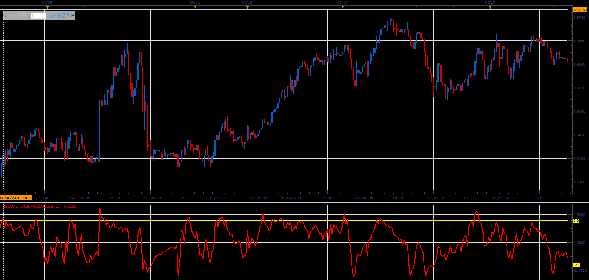

# ZScore

> Source: https://fxcodebase.com/code/viewtopic.php?f=48&t=66573  
> Forum: 48 · Topic 66573 · 3 post(s)

---

## ZScore

**Alexander.Gettinger** · Sun Aug 19, 2018 2:12 pm

ZScore = (Close - MVA of Close)/ Stdev of Close;

Z Scope basically translate the movement of Price within the Bollinger Bands,
to move within a fixed, deviation channel.
Every time B.B. touches the channel, Z Scope do the same thing.

 

Download:

 [ZScore_JS.jsl](files/120680/ZScore_JS.jsl)

---

## Re: ZScore

**logicgate** · Thu Aug 15, 2019 10:11 am

Hi there my friend.

Can you please code a MT4 version using volume weighted moving averages?

---

## Re: ZScore

**Apprentice** · Mon Sep 02, 2019 5:36 am

Try VWMA ZScore.mq4
[viewtopic.php?f=38&t=20398](https://fxcodebase.com/code/viewtopic.php?f=38&t=20398)
