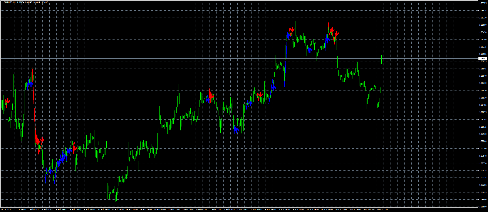

# 1-2-3 Pattern

> Source: https://fxcodebase.com/code/viewtopic.php?f=38&t=74716  
> Forum: 38 · Topic 74716 · 4 post(s)

---

## 1-2-3 Pattern

**Apprentice** · Wed Mar 20, 2024 2:28 pm

Based on TS2 version
[https://fxcodebase.com/code/viewtopic.php?f=17&p=152719](https://fxcodebase.com/code/viewtopic.php?f=17&p=152719)

 [1-2-3 Pattern.mq4](files/154748/1-2-3%20Pattern.mq4)

---

## Re: 1-2-3 Pattern

**phnthnhnm** · Sat May 31, 2025 10:47 pm

Dear Expert,
May I ask MT5 version of this indicator?
Thank you.

---

## Re: 1-2-3 Pattern

**Apprentice** · Sun Jun 01, 2025 1:36 pm

We have added your request to the development list.
Development reference 358

---

## Re: 1-2-3 Pattern

**Apprentice** · Wed Jun 04, 2025 3:47 pm

[1-2-3_Pattern.mq5](files/159454/1-2-3_Pattern.mq5)

Try this version.
