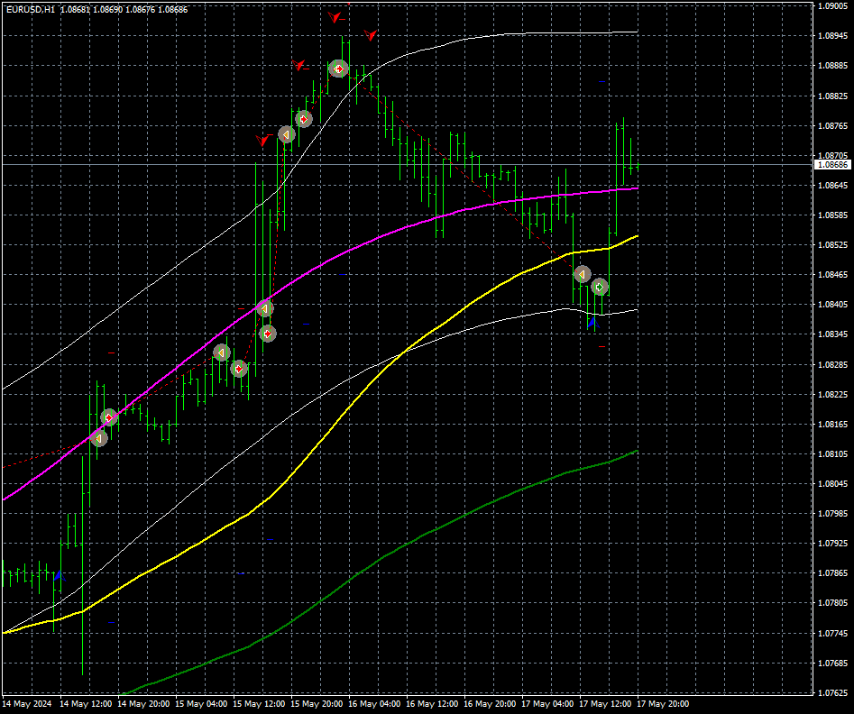
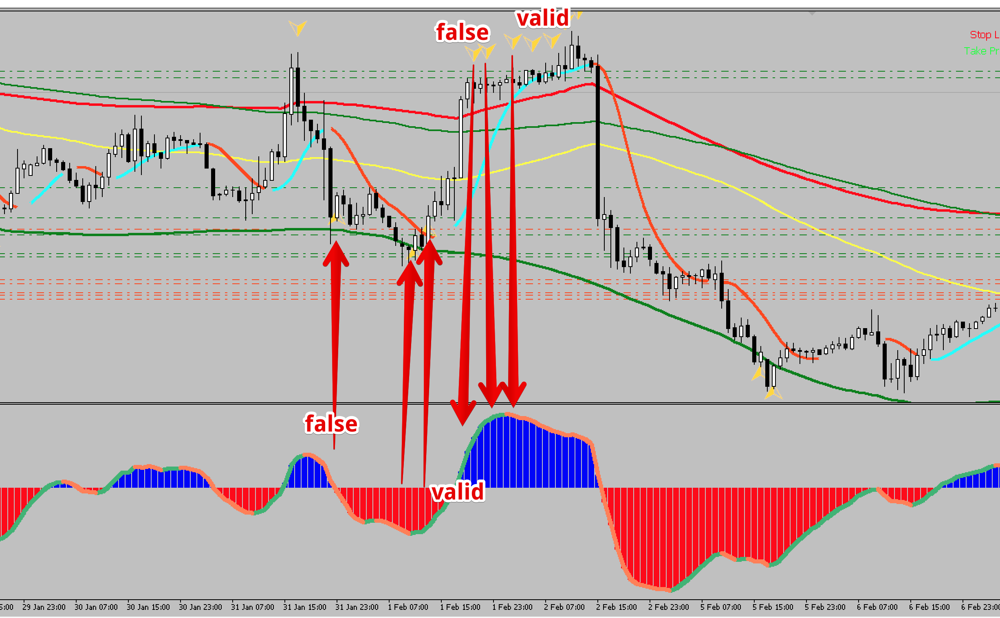
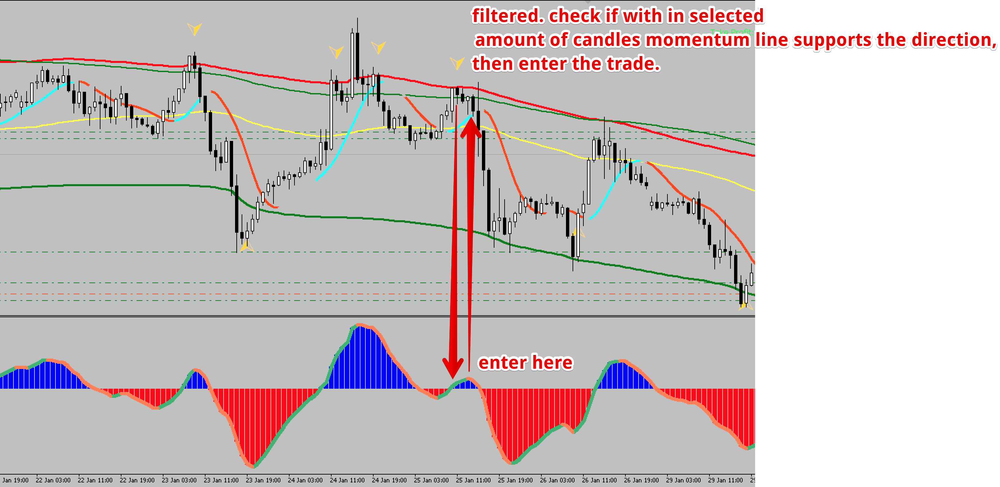
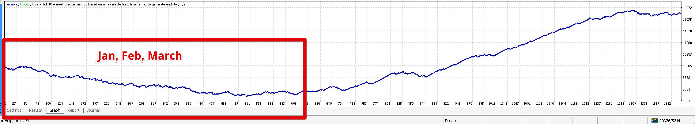
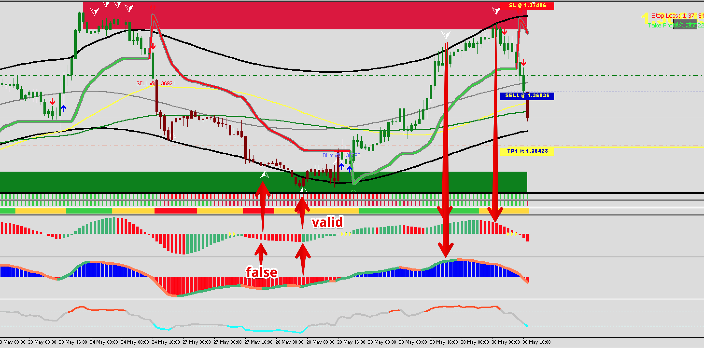
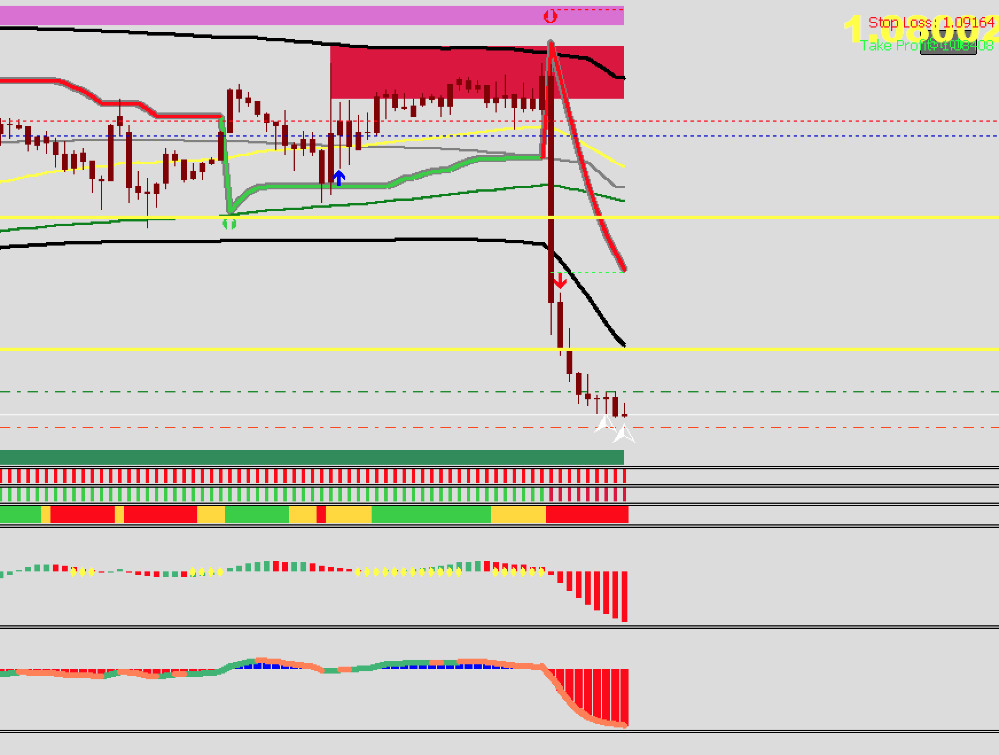

# 100_NRP_EA

> Source: https://fxcodebase.com/code/viewtopic.php?f=38&t=74875  
> Forum: 38 · Topic 74875 · 20 post(s)

---

## 100_NRP_EA

**Apprentice** · Fri May 17, 2024 12:03 pm

Based on the request.
[https://fxcodebase.com/code/viewtopic.php?f=27&p=155243](https://fxcodebase.com/code/viewtopic.php?f=27&p=155243)

 [100% Non Repaint Indicator V22.0.ex4](files/155357/100%20Non%20Repaint%20Indicator%20V22.0.ex4)

 [100_NRP_EA_v1.00.mq4](files/155357/100_NRP_EA_v1.00.mq4)

---

## Re: 100_NRP_EA

**trtrader** · Sun May 19, 2024 9:05 am

Thanks a lot.

Could you please add the attached indicator as filter?

EA will only enter sell trades if the line is orange and buy trades if the momentum line is green.

 

After the arrow appears if momentum is not going in the direction of the arrow, Would be great to have an extra option for EA to check a few candles later if momentum changes so it can enter the trade.

 

---

## Re: 100_NRP_EA

**Apprentice** · Wed May 22, 2024 1:57 pm

We have added your request to the development list.
Development reference 420

---

## Re: 100_NRP_EA

**crypto0014** · Sun May 26, 2024 11:36 pm

pls fix this

---

## Re: 100_NRP_EA

**Apprentice** · Wed May 29, 2024 9:42 am

[Natural Momentum.ex4](files/155561/Natural%20Momentum.ex4)

 [100_NRP_EA_v1.10.mq4](files/155561/100_NRP_EA_v1.10.mq4)

---

## Re: 100_NRP_EA

**trtrader** · Wed May 29, 2024 11:21 am

thanks a lot. Could you please add a regular trailing stop with, start, step and distance?

Also, would be great if you could find a solution for markets like jan to April 2023 to prevent the EA opening trades? or open only filtered ones?

it doesn't work on trending markets.

 

---

## Re: 100_NRP_EA

**trtrader** · Thu May 30, 2024 10:00 am

Also for confirmation, could you please add this indicator? [https://www.mql5.com/en/market/product/ ... e=External](https://www.mql5.com/en/market/product/98633?source=External)

Rules below. when both indicators show momentum growing, allow buy, momentum declining allow sell.

 

---

## Re: 100_NRP_EA

**Apprentice** · Sun Jun 02, 2024 2:36 pm

We have added your request to the development list.
Development reference 457

---

## Re: 100_NRP_EA

**Apprentice** · Tue Jun 04, 2024 4:57 pm

[100_NRP_EA_v1.20.mq4](files/155647/100_NRP_EA_v1.20.mq4)

Try this version.

---

## Re: 100_NRP_EA

**trtrader** · Fri Jun 07, 2024 7:41 pm

Today It opened a buy order when MP squeeze momentum filter was on, but was still red. Could you please double check the codes?

 

---

## Re: 100_NRP_EA

**trtrader** · Fri Jun 07, 2024 8:04 pm

I just checked and it says missing indicator file. The problem is its a market indicator.

could you please change the source folder for indicator to market?

---

## Re: 100_NRP_EA

**trtrader** · Fri Jun 07, 2024 8:45 pm

Could you please also add, opposite logic option? if true, buys are sell, sells are buy.
Thanks

---

## Re: 100_NRP_EA

**Apprentice** · Sat Jun 08, 2024 8:28 am

We have added your request to the development list.
Development reference 469

---

## Re: 100_NRP_EA

**Apprentice** · Wed Jun 12, 2024 2:07 pm

[100_NRP_EA_v1.30.mq4](files/155729/100_NRP_EA_v1.30.mq4)

Try this version.

---

## Re: 100_NRP_EA

**trtrader** · Thu Jun 13, 2024 9:58 pm

still opening some trades when the squeeze momentum indicator is growing. Could you please check again?

 

---

## Re: 100_NRP_EA

**Apprentice** · Sun Jun 16, 2024 9:46 am

We have added your request to the development list.
Development reference 506

---

## Re: 100_NRP_EA

**Apprentice** · Wed Jun 19, 2024 5:04 pm

If the "Open position at" setting is set to "Immediately", this may occur because the candle has not yet closed and it is possible that the indicator shows a drop until the candle's closing time, but when the candle closes, it may actually be a rise, and vice versa.

---

## Re: 100_NRP_EA

**trtrader** · Wed Jun 19, 2024 9:58 pm

Thanks, will test again with your suggestions.

---

## Re: 100_NRP_EA

**khanatd** · Thu Oct 09, 2025 10:33 pm

hi sir is it fixed mt4 non repaint version EA nrp?

thanks
khan

---

## Re: 100_NRP_EA

**Apprentice** · Sun Oct 12, 2025 2:21 am

We have added your request to the development list.
Development reference 651
