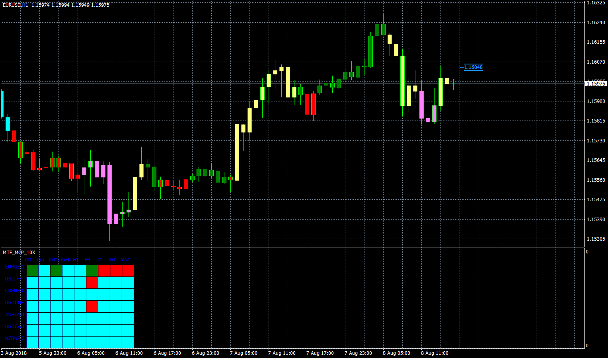

# 10XColour

> Source: https://fxcodebase.com/code/viewtopic.php?f=38&t=66581  
> Forum: 38 · Topic 66581 · 4 post(s)

---

## 10XColour

**Apprentice** · Tue Aug 21, 2018 6:46 am

My interpretation of John Carter's 10X Bars. Am sure there is a little more to it. Uses DMI and ADX to show if the market is in a trend or ranging. Uses volume to show if the market will possibly continue or not.
Based on TS2 version.
[viewtopic.php?f=17&t=65137](https://fxcodebase.com/code/viewtopic.php?f=17&t=65137)

 [10XColour.mq4](files/120717/10XColour.mq4)

 [MTF MCP 10X Colour Heat Map.mq4](files/120717/MTF%20MCP%2010X%20Colour%20Heat%20Map.mq4)

---

## Re: 10XColour

**yomistel** · Wed Feb 27, 2019 2:37 am

The MTF version has errors in it. It kept generating the following error message in MT4 window. Are you able to fix this, please? Many thanks in advance.

MTF MCP 10X Colour Heat MapMOD AUDNZD,M15: invalid integer number as parameter 2 for 'iCustom' function

---

## Re: 10XColour

**Apprentice** · Thu Feb 28, 2019 4:53 am

Try it now.

---

## Re: 10XColour

**yomistel** · Sun Mar 10, 2019 8:00 am

Much appreciation.
