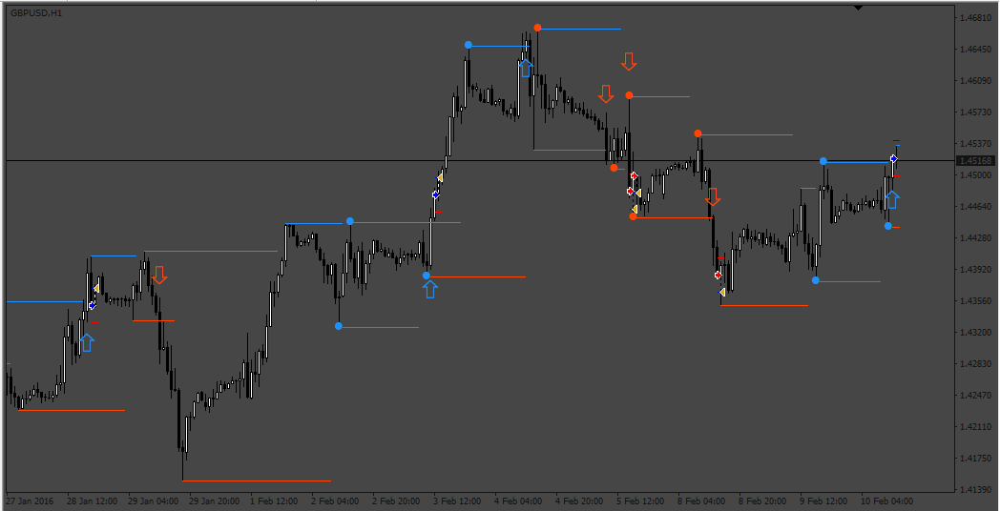
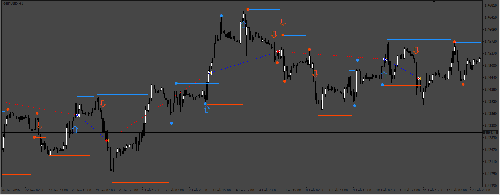
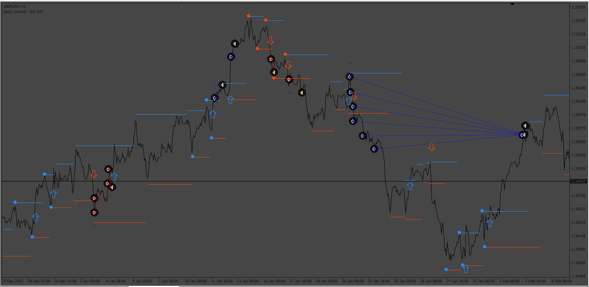

# 123PatternsV6_EA

> Source: https://fxcodebase.com/code/viewtopic.php?f=38&t=73261  
> Forum: 38 · Topic 73261 · 5 post(s)

---

## 123PatternsV6_EA

**Apprentice** · Mon Jan 23, 2023 10:16 am

 

Based on the request.
[https://fxcodebase.com/code/viewtopic.php?f=27&t=8816](https://fxcodebase.com/code/viewtopic.php?f=27&t=8816)

 [123PatternsV6.mq4](files/149247/123PatternsV6.mq4)

 [123PatternsV6_EA.mq4](files/149247/123PatternsV6_EA.mq4)

---

## Re: 123PatternsV6_EA

**123signal** · Thu Aug 24, 2023 2:32 am

Can you add open more lots when the price goes against the trend with the number of lots multiplied

---

## Re: 123PatternsV6_EA

**123signal** · Thu Aug 24, 2023 2:33 am

Can you add open more lots when the price goes against the trend with the number of lots multiplied

---

## Re: 123PatternsV6_EA

**Apprentice** · Mon Aug 28, 2023 5:19 am

We have added your request to the development list.
Development reference 776.

---

## Re: 123PatternsV6_EA

**Apprentice** · Fri Sep 01, 2023 6:20 am

 [123PatternsV6_EA_GRID.mq4](files/152335/123PatternsV6_EA_GRID.mq4)
