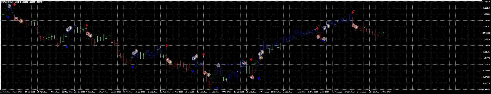

# 12G_Signal_EA

> Source: https://fxcodebase.com/code/viewtopic.php?f=38&t=73451  
> Forum: 38 · Topic 73451 · 3 post(s)

---

## 12G_Signal_EA

**Apprentice** · Sun Mar 05, 2023 5:11 pm

Based on the request.
[https://fxcodebase.com/code/viewtopic.php?f=27&p=149726](https://fxcodebase.com/code/viewtopic.php?f=27&p=149726)

 [12G_Signal_EA_v1.00.mq4](files/149863/12G_Signal_EA_v1.00.mq4)

 [12G_Signal++.mq4](files/149863/12G_Signal.mq4)

---

## Re: 12G_Signal_EA

**Sensible** · Mon Mar 06, 2023 8:26 am

Hi Apprentice,

I really appreciate the approval and development of this EA. Thanks

I have some correction with this EA after testing it on Mq4 Strategy tester.

The Trailing Stop and BreakEven is not working for Open Sell trade But it only working for Open Buy only. Please help me to make it to work for Sell too.

Looking forward to this correction Sir. Thanks alot.

---

## Re: 12G_Signal_EA

**Sensible** · Tue Mar 07, 2023 8:25 am

Good day,

 So sorry for sending another message.

On the issue of Trailing Stop and BreakEven not working on Sell side I have discovered where I am making the mistake it now working on both side. the error is from me. It now working on both side.

Thank you.
