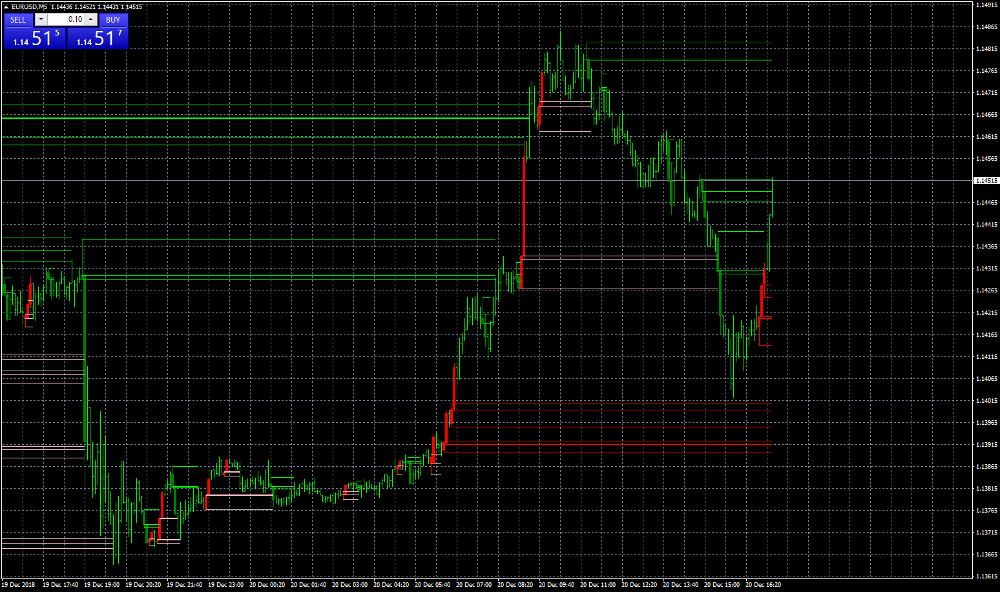
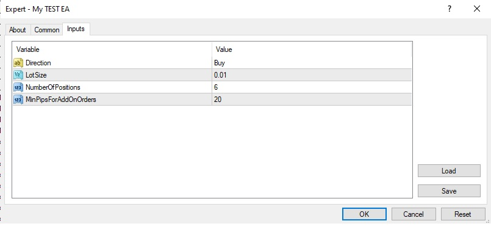
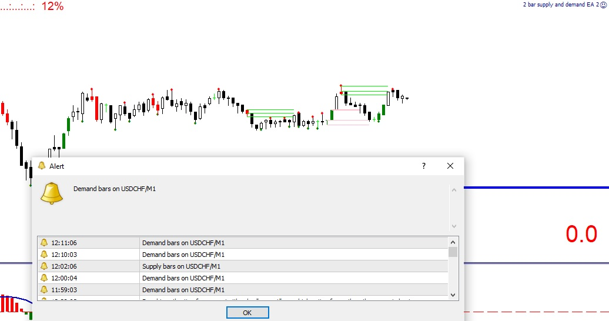

# 2 bar supply and demand

> Source: https://fxcodebase.com/code/viewtopic.php?f=38&t=67183  
> Forum: 38 · Topic 67183 · 24 post(s)

---

## 2 bar supply and demand

**Apprentice** · Thu Dec 20, 2018 2:11 pm

Based on request.
[viewtopic.php?f=27&t=67172](https://fxcodebase.com/code/viewtopic.php?f=27&t=67172)

 [2 bar supply and demand.mq4](files/122967/2%20bar%20supply%20and%20demand.mq4)

---

## Re: 2 bar supply and demand

**Stomp2k** · Mon Dec 31, 2018 1:32 pm

excellent indicator!!!

Can this be made to an EA

Buy:
option 1 - Once a new demand level is created, immediate Buy
option 2: - Once a new demand level is created, set pending Buy on retest of this level
Stop on both options: set 1 pip below the wide demand level, or enter set value
Alternative Stop: set 1 pip below the narrow demand level
Target: ratios Risk:Reward, or enter set value
Send push notification to confirm entry has activated.

Sell:
option 1 - Once a new supply level is created, immediate Sell
option 2: - Once a new supply level is created, set pending Sell on retest of this level
Stop on both options: set 1 pip above the wide supply level, or enter set value
Alternative Stop: set 1 pip above the narrow supply level
Target: ratios Risk:Reward, or enter set value
Send push notification to confirm entry has activated.

must be able to edit lot size, work on all pairs, work on all time frames, work in metatrader4

---

## Re: 2 bar supply and demand

**Stomp2k** · Tue Jan 01, 2019 7:31 pm

awesome!

Can you make this into an EA

Open Buy: at confirmed creation of demand level
Stop option #1: Stop just below distal line or a set value
Stop option #2: Stop just below narrow demand band or a set value
Target: option of Risk/Reward ratio or a set value

Open Buy Limit: at 1st retest of demand level
Stop option #1: Stop just below distal line or a set value
Stop option #2: Stop just below narrow demand band or a set value
Target: option of Risk/Reward ratio or a set value

Open Sell: at confirmed creation of supply level
Stop option #1: Stop just above distal line or a set value
Stop option #2: Stop just above narrow demand band or a set value
Target: option of Risk/Reward ratio or a set value

Open Sell Limit: at 1st retest of supply level
Stop option #1: Stop just above distal line or a set value
Stop option #2: Stop just above narrow demand band or a set value
Target: option of Risk/Reward ratio or a set value

must be able to set lot size to trade
trade in any timeframe
send push notification upon a confirmed entry & exit
work in mt4

---

## Re: 2 bar supply and demand

**Stomp2k** · Tue Jan 01, 2019 8:06 pm

is it possible to make the supply zones and demand zones narrow bands color filled? Possible a code line I could add or change.

---

## Re: 2 bar supply and demand

**Apprentice** · Wed Jan 02, 2019 6:00 am

Your request is added to the development list under Id Number 4392

---

## Re: 2 bar supply and demand

**Apprentice** · Sun Jan 06, 2019 6:25 am

[2 bar supply and demand.mq4](files/123223/2%20bar%20supply%20and%20demand.mq4)

 [2 bar supply and demand EA.mq4](files/123223/2%20bar%20supply%20and%20demand%20EA.mq4)

Try this version.

---

## Re: 2 bar supply and demand

**Stomp2k** · Sun Jan 06, 2019 7:17 am

Will perform upcoming testing., however, the indicator appears to have wide band side of level filled, I would prefer the narrow band to be filled (ie demand level to fill = high of first bar to low of second bar) and (ie supply level to fill = low of first bar to high of 2nd bar)

I have not tested EA, yet it MUST respond at these same levels as mentioned above
Thank you for great work and willingness to revise

---

## Re: 2 bar supply and demand

**kankatrader** · Thu Jan 17, 2019 2:30 am

Hello

can you please convert this expert advisor to Lua for trading station.

Best regards

---

## Re: 2 bar supply and demand

**Apprentice** · Fri Jan 18, 2019 5:21 am

Your request is added to the development list under Id Number 4429

---

## Re: 2 bar supply and demand

**Apprentice** · Fri Jan 25, 2019 6:50 am

TS2/Lua version.
[viewtopic.php?f=17&t=67299](https://fxcodebase.com/code/viewtopic.php?f=17&t=67299)

---

## Re: 2 bar supply and demand

**Stomp2k** · Sun Sep 13, 2020 11:14 am

I need a new Revised EA for this 2bar indicator.

Buy Rules
Once a 2bar demand level is confirmed at candle close, Enter Buy #1
Possible Additional Buy Entries set by user input(see attached) NumberOfPositions - Max
Buy a 2nd 2bar demand level confirmed Entry only if price is better (lower) than first entry by X amount of pips, also defined by user input as (MinPipsForAddOnOrders).
Each entry will be same lot size defined by user..

Sell Rules
Once a 2bar supply level is confirmed at candle close, Enter Sell #1
Possible Additional Sell Entries set by user input(see attached) NumberOfPositions - Max
Sell at 2nd 2bar supply level confirmed Entry only if price is better (higher) than first entry by X amount of pips, also defined by user input as (MinPipsForAddOnOrders).
Each entry will be same lot size defined by user..

This EA strategy has no stop or no target, I only needed to make precise auto entries at multiple price points based on the 2bar indicator.

I need this EA for mt4 with mql4

---

## Re: 2 bar supply and demand

**Apprentice** · Mon Sep 14, 2020 6:54 am

Your request is added to the development list.
Development reference 2024.

---

## Re: 2 bar supply and demand

**Apprentice** · Tue Sep 15, 2020 7:55 am

[2 bar supply and demand EA 2.mq4](files/137617/2%20bar%20supply%20and%20demand%20EA%202.mq4)

Try this version.

---

## Re: 2 bar supply and demand

**Stomp2k** · Tue Sep 15, 2020 11:22 am

Thanks for speedy response.
Upon testing I find I am getting Alerts when my levels form, however the EA is not executing the trades. settings in both directions to attempt to execute first trade

---

## Re: 2 bar supply and demand

**Apprentice** · Wed Sep 16, 2020 11:04 am

Your request is added to the development list.
Development reference 2040.

---

## Re: 2 bar supply and demand

**Apprentice** · Thu Sep 17, 2020 3:15 am

I don't have any issues.

---

## Re: 2 bar supply and demand

**Stomp2k** · Thu Nov 26, 2020 1:36 pm

the indicator appears to have wide band side of level filled, I would prefer the narrow band to be filled (ie demand level to fill = high of first bar[1]to low of second bar[0]) and (ie supply level to fill = low of first bar[1] to high of 2nd bar[0])

Can this indicator be programmed with a toggle option of narrow filled, or wide filled?

Id prefer this request for mt4 version

Many thanks in advance

---

## Re: 2 bar supply and demand

**jackieta** · Fri Dec 18, 2020 3:08 am

> **Apprentice wrote:**
>
>
> 2 bar supply and demand EA 2.mq4
>
>
> Try this version.

Hi,
Can you make it in MT5? Thanks

---

## Re: 2 bar supply and demand

**Apprentice** · Fri Dec 18, 2020 5:12 am

Your request is added to the development list.
Development reference 2489.

---

## Re: 2 bar supply and demand

**Apprentice** · Mon Dec 21, 2020 2:52 am

[2 bar supply and demand.mq5](files/139720/2%20bar%20supply%20and%20demand.mq5)

 [2 bar supply and demand EA 2.mq5](files/139720/2%20bar%20supply%20and%20demand%20EA%202.mq5)

---

## Re: 2 bar supply and demand

**jackieta** · Tue Jan 26, 2021 6:48 am

> **Apprentice wrote:**
>
>
> 2 bar supply and demand.mq5
>
>
>
>
> 2 bar supply and demand EA 2.mq5

Thanks for mt5 version but I hit the error Unsupported filling mode when doing backtest as below:

2021.01.26 18:31:05.319	Core 1	2021.01.18 16:00:00 failed market sell 0.1 EURUSD sl: 1.30661 tp: 1.20561 [Unsupported filling mode]
My broker is ICmarkets.

Another request, could you please add:
 - ''High/low of x bar'' in Stop loss type
 - ''Set in % of stop loss'' in Take profit type
Make it the same as mt4 version
Thanks.

---

## Re: 2 bar supply and demand

**Apprentice** · Wed Jan 27, 2021 3:26 am

Your request is added to the development list.
Development reference 121.

---

## Re: 2 bar supply and demand

**Apprentice** · Sun Jan 31, 2021 10:12 am

[2 bar supply and demand EA 2.mq5](files/140469/2%20bar%20supply%20and%20demand%20EA%202.mq5)

Try this version.

---

## Re: 2 bar supply and demand

**murilovagner** · Thu Mar 11, 2021 10:57 am

Hello Apprentice, It would be possible to put a button for the EA to close all orders when it reaches a certain profit in USD. I say all orders from all pairs together. and Also a general stop and a general take profit.

thanks
