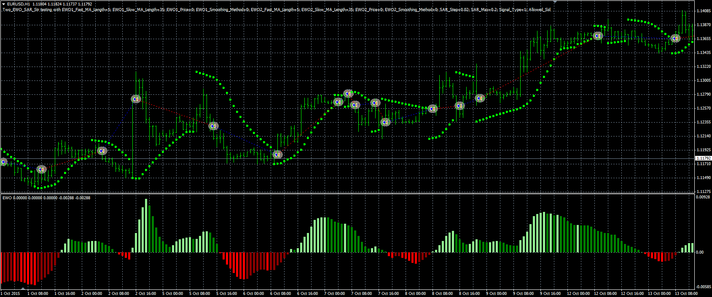

# 2 EWO&SAR strategy

> Source: https://fxcodebase.com/code/viewtopic.php?f=38&t=63292  
> Forum: 38 · Topic 63292 · 1 post(s)

---

## 2 EWO&SAR strategy

**Alexander.Gettinger** · Thu Mar 24, 2016 1:19 pm

The strategy based on SAR and Elliot Wave oscillator ([viewtopic.php?f=38&t=63204&p=105067](https://fxcodebase.com/code/viewtopic.php?f=38&t=63204&p=105067)).

Buy condition: EWO1 and EWO2 are growing and SAR<Close price.
Sell condition: EWO1 and EWO2 are falling and SAR>Close price.

 

Download:

 [Two_EWO_SAR_Str.mq4](files/105446/Two_EWO_SAR_Str.mq4)

Elliot Wave oscillator ([viewtopic.php?f=38&t=63204&p=105067](https://fxcodebase.com/code/viewtopic.php?f=38&t=63204&p=105067)) should be installed for correct work.
