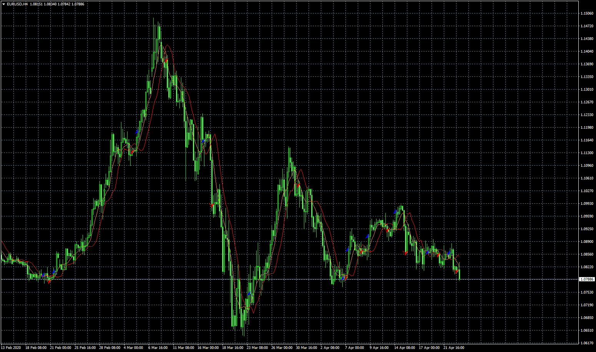

# 2 MA Crossing Overlay

> Source: https://fxcodebase.com/code/viewtopic.php?f=38&t=69718  
> Forum: 38 · Topic 69718 · 8 post(s)

---

## 2 MA Crossing Overlay

**Apprentice** · Thu Apr 23, 2020 4:35 am

Based on request.
[viewtopic.php?f=27&t=69689](https://fxcodebase.com/code/viewtopic.php?f=27&t=69689)

 [2 MA Crossing Overlay.mq4](files/133097/2%20MA%20Crossing%20Overlay.mq4)

 [2 MA Crossing EA.mq4](files/133097/2%20MA%20Crossing%20EA.mq4)

---

## Re: 2 MA Crossing Overlay

**easytrading** · Fri Apr 24, 2020 4:49 am

if you please, Apprentice to converted to MT4 strategy EA that will open positions based on the crossing as below :

Buy : when SMA ( shift 0) cross above SMA ( shift #)
Sell : Opposite crossing .

with the following parameters :

Direction : Buy & sell / Buy /sell .
Lot size : 0.01 and up
T/P : pips
S/L : pips

your help is highly appreciated with many thanks in advance.

---

## Re: 2 MA Crossing Overlay

**Apprentice** · Fri Apr 24, 2020 12:56 pm

Your request is added to the development list.
Development reference 1126.

---

## Re: 2 MA Crossing Overlay

**Apprentice** · Tue Apr 28, 2020 10:48 am

2 MA Crossing EA.mq4 added.

---

## Re: 2 MA Crossing Overlay

**easytrading** · Mon May 04, 2020 2:18 am

If you please,Apprentice to include Negative shifting for the SMA also to open trades in the EA when the crossing happen. with my highly appreciation.

---

## Re: 2 MA Crossing Overlay

**Apprentice** · Mon May 04, 2020 4:19 am

Your request is added to the development list.
Development reference 1214.

---

## Re: 2 MA Crossing Overlay

**Apprentice** · Fri Jun 12, 2020 6:36 am

Any negative shift will be 0.
Use 0 instead. The real negative shift is not possible.

---

## Re: 2 MA Crossing Overlay

**Albahri65** · Sat Jun 27, 2020 8:33 pm

Following up with you guys
