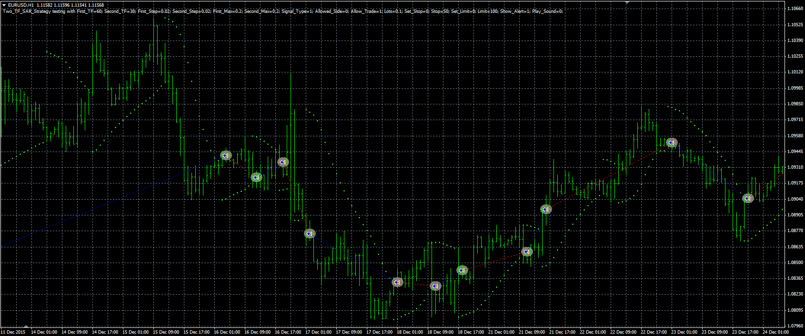

# 2 TF SAR strategy

> Source: https://fxcodebase.com/code/viewtopic.php?f=38&t=63579  
> Forum: 38 · Topic 63579 · 1 post(s)

---

## 2 TF SAR strategy

**Alexander.Gettinger** · Thu Jun 09, 2016 4:45 pm

The strategy based on 2 SAR indicators.

Buy condition: SAR1 starts to show Up trend, SAR2 shows Up trend too.
Sell condition: SAR1 starts to show Dn trend, SAR2 shows Dn trend too.

 

Download:

 [Two_TF_SAR_Strategy.mq4](files/106697/Two_TF_SAR_Strategy.mq4)
