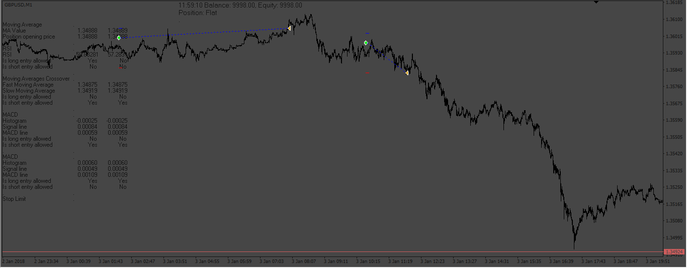

# 20011201_GBPUSD_M1_v2

> Source: https://fxcodebase.com/code/viewtopic.php?f=38&t=73774  
> Forum: 38 · Topic 73774 · 4 post(s)

---

## 20011201_GBPUSD_M1_v2

**Apprentice** · Sat May 27, 2023 4:08 am

Based on the request.
[https://fxcodebase.com/code/viewtopic.p ... 69#p150869](https://fxcodebase.com/code/viewtopic.php?f=27&p=150869#p150869)

 [20011201_GBPUSD_M1_v2.mq4](files/151036/20011201_GBPUSD_M1_v2.mq4)

 [20011201_GBPUSD_M1_v2.mq5](files/151036/20011201_GBPUSD_M1_v2.mq5)

---

## Re: 20011201_GBPUSD_M1_v2

**novaangel123** · Mon May 29, 2023 9:16 am

Thank you Apprentice.

Can you remove the grid opening as well? I just wanted 1 trade at a time.

Also I see that it when i set Base Lot to 1 and multiplier, there are 2 lot trades inside the report. It should be only 1 and 3 in this case.

Appreciate your assistance and God Bless!

---

## Re: 20011201_GBPUSD_M1_v2

**Apprentice** · Wed May 31, 2023 2:10 pm

We have added your request to the development list.
Development reference 496.

---

## Re: 20011201_GBPUSD_M1_v2

**Apprentice** · Tue Jul 04, 2023 10:45 am

 [20011201_GBPUSD_M1_v2.mq4](files/151509/20011201_GBPUSD_M1_v2.mq4)
