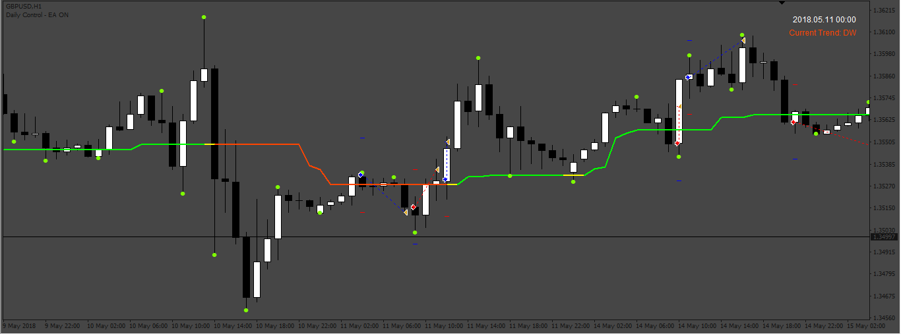

# 3-bars-high-low-indicator EA

> Source: https://fxcodebase.com/code/viewtopic.php?f=38&t=72809  
> Forum: 38 · Topic 72809 · 2 post(s)

---

## 3-bars-high-low-indicator EA

**Apprentice** · Wed Oct 05, 2022 4:39 am

Based on the request.
[https://fxcodebase.com/code/viewtopic.php?f=27&p=147683](https://fxcodebase.com/code/viewtopic.php?f=27&p=147683)

 [3-bars-high-low-indicator.ex4](files/147756/3-bars-high-low-indicator.ex4)

 [3-bars-high-low-indicator EA.mq4](files/147756/3-bars-high-low-indicator%20EA.mq4)

---

## 3-bars-high-low-indicator EA

**Apprentice** · Mon Oct 10, 2022 12:16 pm

 [3-bars-high-low-indicator.mq5](files/147848/3-bars-high-low-indicator.mq5)

 [3BarsHighLowEA.mq5](files/147848/3BarsHighLowEA.mq5)
