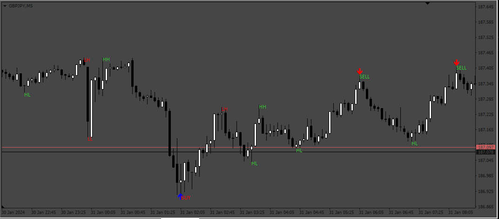

# 3-drives indicator

> Source: https://fxcodebase.com/code/viewtopic.php?f=38&t=74579  
> Forum: 38 · Topic 74579 · 4 post(s)

---

## 3-drives indicator

**Apprentice** · Thu Feb 01, 2024 12:25 pm

Based on the request.
[https://fxcodebase.com/code/viewtopic.php?f=27&p=154077](https://fxcodebase.com/code/viewtopic.php?f=27&p=154077)

 [3-drives indicator.mq4](files/154231/3-drives%20indicator.mq4)

 [3_drives_EA.mq4](files/154231/3_drives_EA.mq4)

---

## Re: 3-drives indicator

**anangfx** · Sun Jun 09, 2024 12:20 am

Can you create an EA with the standard parameters and
the addition of comment EA, marti and averaging grid EAs?

option 1. single entry with TPSL, if loss then it will enter marti when there is a new signal trigger
option 2, averaging grid with marti multiplier or without marti multiplier

news filter addition ONOFF from forexfactory

Martingale multiplier
Maximum lot size
Max attempts

---

## Re: 3-drives indicator

**Apprentice** · Wed Jun 12, 2024 3:16 pm

We have added your request to the development list.
Development reference 491

---

## Re: 3-drives indicator

**Apprentice** · Wed Jun 19, 2024 5:01 pm

I checked the attached EA and it seems to have all the functions requested. I also tested it, and everything works.
